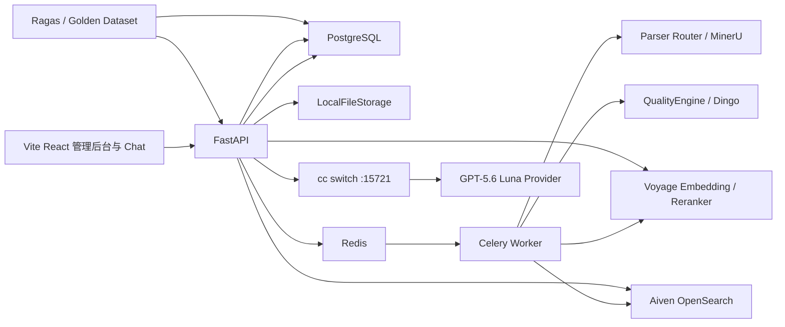
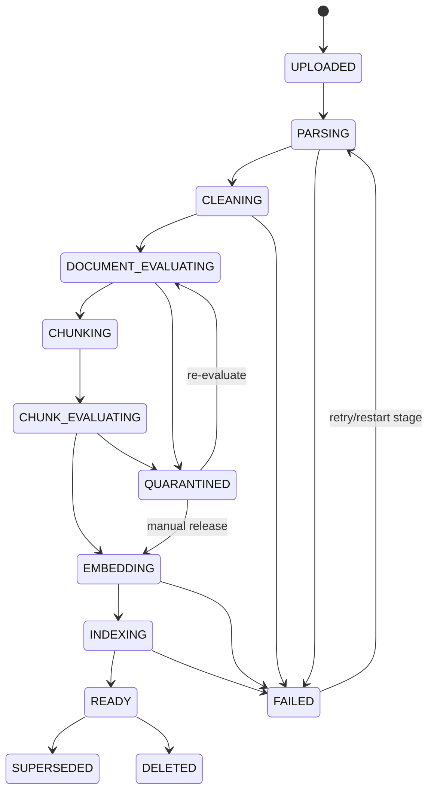

# Robust RAG 完整实施计划

> 文档状态：已确认，可作为实施基线
> 项目类型：中英双语通用企业知识库 RAG
> 当前阶段：阶段 1 已完成，准备进入阶段 2
> 最后更新：2026-08-17

## 1. 文档目的

本文档固化项目已经确认的需求、技术决策、系统边界、数据模型、处理流程、质量体系、检索方案、产品范围、实施阶段和验收标准。

实施过程中允许根据真实数据和评测结果调整参数，但以下原则不可在没有记录架构决策的情况下改变：

- 原始文件和解析产物必须可追溯、可重放。
- Canonical Document Model 不绑定具体解析器、分块框架或索引引擎。
- Dingo 负责入库前质量评估，Ragas 负责入库后 RAG 效果评估。
- OpenSearch 是可重建的检索投影，不是数据唯一来源。
- PostgreSQL 保存持久化业务事实，Redis 只承担队列、短期状态和实时消息职责。
- 所有外部模型和服务必须通过可替换 Adapter 接入。
- 第一阶段只实现纯文本检索，不实现图片理解和多模态检索。

---

## 2. 项目目标

建设一个具备完整数据治理、可靠异步入库、混合召回、父子分块、质量评估、来源引用、离线评测和管理后台的企业知识库 RAG 系统。

### 2.1 业务目标

- 支持企业常见文件上传、解析、质量检查、索引和问答。
- 支持中文、英文及中英混合文档与问题。
- 上传文件完成处理后自动变为可检索状态，无需人工重建索引。
- 回答严格基于企业知识库内容，并提供可验证的来源引用。
- 对解析失败、质量异常、检索失败和模型调用失败提供可解释状态与恢复能力。
- 通过黄金测试集和可重复评测衡量每次算法、模型和参数变更。

### 2.2 初始规模

- 初始文件数：约 50 个。
- 每日新增：约 20 个文件。
- 文件来源：仅管理后台上传。
- 初期并发和响应时间没有正式 SLA，系统必须从第一天记录延迟、吞吐和错误数据。

### 2.3 支持的文件类型

- PDF，包括扫描 PDF 和复杂排版 PDF。
- Word：DOC、DOCX，具体旧格式能力由解析器验证。
- Excel：XLS、XLSX，具体旧格式能力由解析器验证。
- PowerPoint：PPT、PPTX，具体旧格式能力由解析器验证。
- HTML 文件。
- Markdown。
- TXT。

---

## 3. 第一阶段非目标

以下能力明确不属于第一阶段：

- 图片向量、图片检索、图片问答。
- 图表和架构图的 VLM 描述。
- 真正的多模态 RAG。
- 用户登录、组织、角色、权限和 ACL。
- 多租户。
- SharePoint、Confluence、网盘、数据库等数据连接器。
- 复杂 Excel 计算、公式重算和分析引擎。
- Agent、工具调用和互联网搜索。
- 语音和视频。
- Kubernetes 和大规模分布式部署。
- 模型微调。
- 移动端专项适配。

扫描 PDF 的 OCR、PPT 文本框、Excel 单元格、表格文字和公式的文本表达仍属于纯文本处理范围。

---

## 4. 已确认技术栈

| 领域 | 选择 |
|---|---|
| 后端语言 | Python 3.12+ |
| API | FastAPI、Pydantic v2 |
| ORM 与迁移 | SQLAlchemy 2、Alembic、psycopg 3 |
| 异步任务 | Celery |
| Broker | 本机 Redis |
| 持久数据库 | 本机 PostgreSQL |
| 文件存储 | 第一阶段 LocalFileStorage，抽象 S3/MinIO Adapter |
| 解析 | Parser Router，以 MinerU 为核心解析器 |
| 数据清洗 | 自研可插拔 Cleaning Pipeline |
| 入库质量 | 自研 QualityEngine + Dingo Adapter |
| 分块 | 结构感知父子分块，使用 LlamaIndex 的必要组件但不绑定其数据模型 |
| Embedding | Voyage `voyage-4`，默认 1024 维 |
| 检索引擎 | Aiven for OpenSearch |
| 检索策略 | BM25 + Dense Vector + RRF + Reranker |
| Reranker | Voyage `rerank-2.5` |
| 生成模型 | cc switch + `gpt-5.6-luna` |
| cc switch | `http://127.0.0.1:15721/v1` |
| RAG 评测 | 确定性 IR 指标 + Ragas |
| 前端 | Vite、React 19、TypeScript |
| UI | Tailwind CSS 4、shadcn/ui、AI Elements |
| Chat 状态 | AI SDK UI `useChat` + UI Message Stream |
| 前端数据请求 | TanStack Query |
| 前端路由 | React Router |
| E2E | Playwright |
| Python 测试 | pytest |

建议使用 `uv` 管理 Python 依赖、`pnpm` 管理前端依赖，并在项目初始化时锁定准确版本。版本升级必须经过单元测试、集成测试和黄金集回归。

---

## 5. 总体架构



### 5.1 组件职责

#### FastAPI

- 管理上传、文档、版本、任务、质量报告和 Chat API。
- 验证请求并创建持久化任务。
- 向 Celery 投递任务，不在请求线程中处理长任务。
- 执行在线检索、Rerank、上下文组装和 LLM 流式调用。
- 向前端发送 AI SDK UI Message Stream。

#### Celery Worker

- 执行解析、清洗、Dingo、分块、Embedding 和索引任务。
- 每个阶段独立幂等、可重试。
- 只在任务消息中传递 ID，不传递文件或大段正文。

#### PostgreSQL

- 保存业务对象、不可变版本、处理状态和审计信息。
- 保存 Canonical 元数据、Retrieval Node、质量结果和索引同步状态。
- 保存对话、消息、引用、模型调用和评测结果。
- 作为任务恢复和重建索引的事实来源。

#### Redis

- Celery Broker。
- 短期任务结果和状态缓存。
- 进度实时通知。
- 后续限流、短期缓存和多进程协调。
- 不保存唯一业务数据。

#### LocalFileStorage

- 保存原始文件、解析原始产物、Canonical JSON 和衍生资源。
- 通过接口隔离，将来可切换 S3/MinIO。

#### Aiven OpenSearch

- 保存 READY 文档的检索投影。
- 执行 BM25、Dense Vector、过滤、RRF 和高亮。
- 索引可以从 PostgreSQL 与文件存储完整重建。

---

## 6. 核心数据分层

系统采用四层不可混淆的数据模型：

```text
Source Asset
  → Parse Artifact
  → Canonical Document
  → Retrieval Units
```

### 6.1 Source Asset

用户上传的不可修改原始文件和业务文档身份。

### 6.2 Parse Artifact

具体解析器某一次运行产生的原始 JSON、Markdown、表格和资源文件。该层允许多个解析器和多次解析并存。

### 6.3 Canonical Document

与解析器无关的统一结构化文档模型，是清洗、质量、分块和引用的共同输入。

### 6.4 Retrieval Units

面向检索生成的 Parent/Child Node。它们是 Canonical Document 的派生数据，不是原始文档。

---

## 7. PostgreSQL 核心数据模型

### 7.1 Document

表示业务上稳定的一份文档。

```text
document_id
display_name
status
current_version_id
created_at
updated_at
deleted_at
```

### 7.2 DocumentVersion

表示一次不可变文件版本。

```text
document_version_id
document_id
version_number
original_filename
mime_type
file_size
sha256
storage_uri
status
uploaded_at
ready_at
superseded_at
```

### 7.3 IngestionJob

```text
job_id
document_version_id
job_type
status
current_stage
progress_current
progress_total
attempt
error_code
error_message
started_at
finished_at
created_at
```

### 7.4 StageRun

每个阶段单独审计。

```text
stage_run_id
job_id
stage_name
implementation_name
implementation_version
config_snapshot
status
attempt
input_artifact_uri
output_artifact_uri
started_at
finished_at
error
```

### 7.5 ParseRun

```text
parse_run_id
document_version_id
parser_name
parser_version
parser_mode
parser_config
status
artifact_uri
started_at
finished_at
error
```

### 7.6 CanonicalDocumentRecord

```text
canonical_document_id
document_version_id
schema_version
artifact_uri
language
title
block_count
content_hash
created_at
```

### 7.7 RetrievalNode

```text
node_id
document_id
document_version_id
canonical_document_id
node_level
parent_node_id
previous_node_id
next_node_id
title
heading_path
content
retrieval_text
source_locators_json
content_types
language
token_count
quality_status
quality_summary_json
chunker_version
embedding_status
index_status
created_at
```

### 7.8 QualityAssessment

```text
assessment_id
target_type
target_id
evaluator
evaluator_version
rule_set_version
model
prompt_version
status
dimensions_json
issues_json
raw_result_uri
started_at
finished_at
```

### 7.9 Conversation 与 Message

保存多轮对话、原始问题、改写问题、回答、引用和模型调用关联。

### 7.10 ModelInvocation

统一记录 Voyage、Dingo LLM、Ragas Judge 和 GPT 调用：

```text
invocation_id
purpose
provider
model
endpoint
input_tokens
output_tokens
latency_ms
estimated_cost
status
retry_count
trace_id
created_at
```

---

## 8. Canonical Document Model

### 8.1 顶层结构

```text
CanonicalDocument
  schema_version
  document_id
  document_version_id
  title
  language
  metadata
  root_node_id
  blocks
  assets
```

### 8.2 Block 类型

容器类型：

- DOCUMENT
- SECTION
- PAGE
- SLIDE
- SHEET
- LOGICAL_TABLE

内容类型：

- HEADING
- PARAGRAPH
- LIST
- LIST_ITEM
- TABLE
- TABLE_ROW
- CODE
- QUOTE
- FORMULA
- FOOTNOTE
- CAPTION
- NOTE
- ASSET_REFERENCE

### 8.3 CanonicalBlock

```text
block_id
block_type
parent_block_id
previous_block_id
next_block_id
semantic_order
heading_path
original_text
normalized_text
source_locator
attributes
language
token_count
parser_confidence
quality_status
quality_flags
```

必须保留 `original_text`，清洗只能产生 `normalized_text`，不得覆盖原文。

### 8.4 双重结构

Block 同时保存：

1. 语义结构：章节、标题、父子关系和阅读顺序。
2. 物理来源：页码、幻灯片、工作表、单元格和坐标。

PDF 页面不能作为唯一语义父节点，因为章节可能跨页，一页也可能包含多个章节。

### 8.5 SourceLocator

```text
source_type
page_number
slide_number
sheet_name
cell_range
bbox
dom_path
line_start
line_end
char_start
char_end
```

只填写与当前格式相关的字段，一个 Block 可以关联多个 Locator。

---

## 9. 各格式解析映射

### 9.1 Parser Router

Parser Router 根据 MIME、扩展名、内容签名和文件特征选择解析器。扩展名不能作为唯一判断依据。

接口要求：

```text
Parser.can_handle(file_metadata)
Parser.parse(source_uri, config) -> ParseArtifact
Canonicalizer.convert(parse_artifact) -> CanonicalDocument
```

### 9.2 PDF

- MinerU 为主要解析器。
- 保留标题、段落、列表、表格、公式、脚注、页码和坐标。
- 检测扫描 PDF 并开启 OCR。
- 跨页段落可以合并，但必须保留全部页码。
- 跨页表格合并为逻辑表。
- 页眉、页脚和页码不进入检索正文。
- 低 OCR 置信度产生质量警告，不自动拒绝整份文档。

### 9.3 Word

- 按 Heading 层级组织语义结构。
- 保留段落、列表、表格和脚注。
- 使用最终可见正文。
- 批注和已删除修订不进入检索。
- 页码只在可靠时保存，逻辑结构优先。

### 9.4 PowerPoint

- 每张 Slide 是自然 Parent 候选。
- 提取标题、文本框、表格和演讲者备注。
- 演讲者备注参与检索，标记为 `speaker_note`。
- 图片和图表不进入第一阶段检索。

### 9.5 Excel

- Workbook → Sheet → Logical Table。
- 不把整个工作表简单转换成一个 Markdown 文本。
- 保存工作表、逻辑表、表头、行、公式、显示值和单元格范围。
- 隐藏工作表、隐藏行列默认不参与检索。
- 公式和显示值都保存，检索与回答以显示值为主。
- 只支持检索与问答，不执行复杂计算和公式重算。

### 9.6 HTML

- 按标题、段落、列表、表格和引用形成结构。
- 删除导航、页脚、广告、Cookie 提示、Script 和 Style。
- 保留链接文字与 URL。
- 第一阶段只处理用户上传的 HTML 文件，不抓取动态网页。

### 9.7 Markdown/TXT

- Markdown 按标题树、段落、列表、代码块和表格解析。
- TXT 按空行、编号和可能的标题模式识别结构。
- 无可靠结构时，以文档为根并保留行号。

---

## 10. 入库状态机



### 10.1 可见性原则

- 只有 READY 版本可以进入 Chat 检索。
- 新版本 READY 前，旧 READY 版本继续可检索。
- 新版本成功后原子切换当前版本并移除旧版本检索投影。
- 处理中间状态不能产生部分可检索数据。

### 10.2 幂等性

- 每个阶段以 `document_version_id + stage + config_version` 作为幂等边界。
- OpenSearch `_id` 使用确定性 `node_id`，重试时覆盖而不新增重复记录。
- Embedding Batch 保存批次状态，成功批次不重复计费。
- Worker 崩溃后根据 PostgreSQL 状态恢复。
- Celery 任务只传 ID，具体状态必须从 PostgreSQL 重新读取。

### 10.3 重复文件与版本

- 上传时计算 SHA-256。
- 同一文档相同内容重复上传时阻止无意义入库并提示。
- 内容变化创建新版本。
- 重复内容但不同业务文档名称时先警告，由管理操作决定是否保留。

---

## 11. Cleaning Pipeline

第一阶段不引入 Data-Juicer，但预留 DataJuicerAdapter。

### 11.1 清洗原则

- 原文不可修改。
- 所有转换必须可审计。
- 清洗算子独立启停并带版本。
- 结构感知优先于纯文本正则。
- 不套用可能破坏企业文档结构的预训练数据过滤规则。

### 11.2 首版算子

- Unicode 与换行归一化。
- 异常控制字符处理。
- 连续空白规范化。
- 页眉页脚和重复导航清除。
- 明显空 Block 清除。
- 段落阅读顺序修正。
- 精确重复 Block 标记。
- 近重复 Block 识别，但默认只标记不删除。
- 语言识别。
- 表格表头传播准备。
- 来源位置完整性检查。

---

## 12. QualityEngine 与 Dingo

### 12.1 职责边界

- QualityEngine 定义内部评分模型、问题类型、准入策略和审计数据。
- Dingo 是装载到 QualityEngine 的评估器。
- Dingo 不直接修改、删除或发布文档。
- Dingo 输出通过 Adapter 转换，Dingo 数据结构不得成为内部领域模型。

### 12.2 执行顺序

```text
SchemaValidator
  → DeterministicRuleEvaluator
  → DingoRuleEvaluator
  → DingoLLMEvaluator
  → QualityPolicyEngine
```

### 12.3 执行范围

- 确定性规则：所有文档与所有 Child/Parent。
- Dingo 规则：所有文档与所有 Child/Parent。
- Dingo LLM：所有文档。
- Chunk Dingo LLM：异常项、警告项和可配置抽样。
- 初始 Dingo LLM：通过 cc switch 调用 `gpt-5.6-luna`。

### 12.4 质量维度

每个维度使用 0～1 分数并保存证据：

- `parse_completeness`
- `text_integrity`
- `structure_integrity`
- `duplication`
- `information_density`
- `context_completeness`
- `source_traceability`
- `retrieval_readiness`

可以生成 UI 总分，但门控不得只依赖总分。

### 12.5 状态

#### REJECTED

- 文件无法解析。
- 没有任何有效文本。
- 文件内容与格式严重不符且无法恢复。
- 全文基本为乱码。
- Canonical Document 无法构建。

#### QUARANTINED

- 大量页面为空。
- OCR 整体质量极低。
- 文本异常或重复比例过高。
- 结构严重损坏。
- 来源定位大量缺失。
- Dingo 发现高风险质量问题。

#### WARNING

- 少量低置信度 OCR。
- 个别表格解析异常。
- 少量重复内容。
- 个别 Chunk 过短或上下文较弱。
- 标题层级或来源位置存在轻微异常。

#### PASSED

没有阻断问题，可以进入后续阶段。

### 12.6 阈值校准

具体数值阈值不得凭经验永久写死。实施时使用初始 50 个文件完成：

1. 人工标注文档质量。
2. 对比确定性规则与 Dingo 输出。
3. 确定阈值初值。
4. 将阈值放入版本化配置。
5. 使用误拒绝率和漏检率回归。

### 12.7 人工放行

QUARANTINED 文档不可检索。管理员可以重跑、重评、拒绝或强制放行。人工操作必须记录操作者、时间、原因、原状态和质量快照。

---

## 13. 父子分块

### 13.1 原则

- 结构边界优先于 Token 长度。
- 不跨越无关章节。
- Child 用于召回，Parent 用于补充完整上下文。
- 标题路径进入检索文本。
- 表格使用独立策略。
- Chunk Schema 与 LlamaIndex 解耦。

### 13.2 Parent

典型 Parent：

- PDF/Word 的小节。
- PPT 的幻灯片。
- Excel 的逻辑表。
- HTML/Markdown 的标题章节。

初始目标长度：约 1,200～2,500 tokens。短章节不强行补齐；超长章节按语义边界拆分为多个 Parent。

### 13.3 Child

初始目标长度：约 350～600 tokens。
初始重叠：约 50～80 tokens，仅允许在同一 Parent 内发生。

`retrieval_text` 组成：

```text
文档标题
标题路径
内容类型
正文
必要表头或上下文标签
```

### 13.4 表格分块

- Parent 保存完整逻辑表或完整可管理片段。
- Child 保存表头与一组行。
- 每个 Child 重复表头，不重复上一批数据。
- 宽表可以转换成键值记录表达。
- 必须保存 Sheet、逻辑表名和 Cell Range。

### 13.5 Node ID

Node ID 必须在同一 DocumentVersion 和相同分块配置下确定稳定，用于：

- 重试覆盖。
- OpenSearch 幂等写入。
- 质量评估关联。
- 引用和评测复现。

---

## 14. Embedding

### 14.1 模型

- `voyage-4`
- 默认维度：1024
- 文档输入使用 `input_type=document`
- 查询输入使用 `input_type=query`

### 14.2 批处理

- 按 Voyage API Token 和条数限制动态分批。
- 保存 Batch、Token 估算、重试次数和失败项。
- 对 429、5xx 和网络错误使用带抖动的指数退避。
- 对不可重试错误进入 FAILED，不无限重试。

### 14.3 版本化

保存：

```text
embedding_provider
embedding_model
embedding_dimension
embedding_config_version
retrieval_text_hash
embedded_at
```

切换模型时新建索引版本，不在原索引中混合不兼容向量。

---

## 15. Aiven OpenSearch 设计

### 15.1 实施前验证

- 确认 Aiven OpenSearch 实例版本。
- 确认 k-NN、ICU Analysis 和 Neural Search 插件可用。
- 推荐版本至少支持 OpenSearch 2.19 的 RRF `score-ranker-processor`。
- 如果实例暂不支持原生 RRF，则临时在应用层融合并记录迁移计划。
- 使用 TLS、CA 验证和独立最小权限服务账号。

### 15.2 索引与别名

```text
rag-documents-v1
rag-chunks-v1

rag-documents-read → rag-documents-v1
rag-chunks-read    → rag-chunks-v1
rag-chunks-write   → rag-chunks-v1
```

模型、Mapping 或分块重大变化时创建 v2，完成重建与评测后原子切换别名。

### 15.3 Chunk Mapping 核心字段

```text
node_id: keyword
document_id: keyword
document_version_id: keyword
parent_node_id: keyword
previous_node_id: keyword
next_node_id: keyword
node_level: keyword
title: text + keyword
heading_path: text + keyword
content: text
retrieval_text: text
language: keyword
content_types: keyword
page_numbers: integer
slide_numbers: integer
sheet_name: keyword
cell_ranges: keyword
quality_status: keyword
quality_score: float
quality_flags: keyword
embedding_model: keyword
embedding: knn_vector, dimension 1024, cosine
document_updated_at: date
```

### 15.4 中英混合字段

- `title.icu`、`content.icu`、`retrieval_text.icu` 用于中英混合检索。
- `standard` 子字段用于英文标准分析。
- 文件名、编号、型号、合同号和路径使用 keyword/专用精确字段。
- 标题、文件名和标识符具有比正文更高的 BM25 权重。
- 需要根据真实文档建立企业词汇、缩写和同义词测试集。

### 15.5 OpenSearch 不是事实来源

- OpenSearch 中只写 READY 当前版本。
- 所有数据均可从 PostgreSQL 和文件存储重建。
- 每次写入保存同步状态和索引版本。
- 删除和版本切换必须验证旧投影已移除。

---

## 16. 在线检索流程

### 16.1 初始基线

```text
Query Normalize / Rewrite
  → BM25 Top 100
  → voyage-4 Dense Top 100
  → RRF Top 60
  → 文档和 Parent 多样性控制
  → rerank-2.5 Top 40
  → Child Top 8～12
  → Parent/相邻块/表头扩展
  → 上下文预算裁剪
  → GPT-5.6 Luna
```

### 16.2 RRF

- 初始 BM25 与 Dense 等权。
- 初始 `rank_constant=60`。
- 参数进入配置，不能硬编码。
- 有黄金集后使用训练/验证拆分调节权重。

### 16.3 多样性

- 同一文档进入 Reranker 的 Child 默认不超过 8 个。
- 同一 Parent 默认不超过 3 个 Child。
- 防止单份长文档占满全部候选。
- 保留精确编号、文件名和关键词命中结果。

### 16.4 Rerank

- 使用 `rerank-2.5`。
- 输入包含 Query、标题路径、内容类型和 Child 正文。
- 保存输入候选、原始排名、重排分数、模型和耗时。
- 失败时允许配置降级到 RRF 结果，但必须在 trace 中标记。

### 16.5 Parent 扩展

- Child 命中后获取 Parent。
- 仅在正文截断、列表连续或引用跨块时补充相邻块。
- 表格自动补充表头。
- 去除重复文本后再进行上下文预算裁剪。

---

## 17. LLM 与 cc switch

### 17.1 配置

```text
LLM_BASE_URL=http://127.0.0.1:15721/v1
LLM_MODEL=gpt-5.6-luna
LLM_API_STYLE=responses
LLM_REASONING_EFFORT=medium
```

必须使用准确模型 ID `gpt-5.6-luna`，不能使用会指向其他层级的 `gpt-5.6` 别名。

### 17.2 实施前契约测试

cc switch 已确认以下本地路由存在：

- `/health`
- `/status`
- `/v1/chat/completions`
- `/v1/responses`
- `/v1/messages`

但 `/v1/models` 当前返回空列表，因此实现前必须通过最小真实调用验证：

- `gpt-5.6-luna` 模型映射。
- 非流式文本。
- SSE 流式输出。
- Structured Output。
- 多轮输入。
- 错误格式、超时和 Token Usage。

### 17.3 Provider 抽象

```text
LLMProvider
  ├── CCSwitchResponsesProvider
  ├── OpenAICompatibleProvider
  └── FakeLLMProvider
```

浏览器不得直接调用 cc switch。调用链固定为 Browser → FastAPI → cc switch → 上游 Provider。

### 17.4 Grounded RAG

- 只基于检索上下文回答企业事实。
- 信息不足时明确拒答。
- 不使用模型记忆补充企业事实。
- 回答语言跟随用户问题。
- 每个主要事实尽量带引用。
- 保存 Prompt 模板版本和最终上下文节点。

### 17.5 多轮问答

- 保存对话和消息。
- 检索前生成独立、可检索的 Query Rewrite。
- 只使用解决指代所需的历史，不把完整历史直接拼入检索 Query。
- 保存原始问题与改写问题，便于评测和调试。

### 17.6 引用

引用至少包含：

- 文档名称。
- 标题路径。
- 页码、幻灯片或工作表。
- Node ID。
- 原文片段。

点击引用可以打开来源面板并定位到可用的原始位置。

---

## 18. Chat 流式协议

- 前端使用 `@ai-sdk/react` 的 `useChat`。
- 使用可配置 Transport 指向 FastAPI `/api/v1/chat`。
- FastAPI 实现 AI SDK UI Message Stream，而不是只返回纯文本。
- 使用 SSE 发送文本、来源、状态、用量和错误等 Data Part。

建议事件类型：

```text
data-retrieval-status
data-source
data-usage
data-warning
text-start / text-delta / text-end
```

不得向普通用户发送完整内部 Prompt、全部候选或敏感配置。

---

## 19. 管理后台范围

### 19.1 文档管理

- 单文件与批量拖拽上传。
- 文档列表、搜索和状态筛选。
- 实时处理进度。
- 当前可检索版本与历史版本。
- Parser、配置和质量版本。
- Dingo 质量报告。
- Parent/Child 和来源位置查看。
- OpenSearch 同步状态。

### 19.2 操作

- 重试失败任务。
- 重新解析。
- 重新清洗。
- 重新运行 Dingo。
- 重新分块。
- 重新生成 Embedding。
- 重新索引。
- 隔离文档人工放行或拒绝。
- 软删除、恢复和永久删除。

重新执行某阶段时，所有依赖其结果的下游产物自动失效。

### 19.3 总览

- 文档总数和 READY 数量。
- 处理中、警告、隔离和失败数量。
- 当日新增和平均处理时间。
- 最近失败任务。
- Dingo 问题类型分布。
- PostgreSQL、Redis、OpenSearch、cc switch 和外部服务状态。

---

## 20. Chat 前端范围

- 新建对话与对话历史。
- 流式回答、停止和重新生成。
- Markdown、代码块和表格。
- 复制回答。
- 来源引用与来源展开面板。
- 文件名、章节、页码、幻灯片、工作表定位。
- 错误与拒答展示。
- 中文、英文和中英混合问答。

管理员调试视图额外显示：

- 原始与改写 Query。
- BM25 和 Dense 候选。
- RRF 排名。
- Reranker 分数。
- 最终 Child、Parent 和相邻块。
- 最终上下文预算与模型调用信息。

AI Elements 按源码组件集成并允许修改。由于其官方流程偏向 Next.js，实施时必须验证 Vite 路径别名、Tailwind、浏览器组件和流式渲染兼容性。

---

## 21. 删除与恢复

### 21.1 软删除

- 设置 `Document.status=DELETED`。
- 立即从 OpenSearch 移除。
- 不再被 Chat 检索。
- PostgreSQL、原始文件和解析产物保留。
- 支持恢复。

### 21.2 永久删除

必须二次确认，删除：

- 原始文件。
- Parse Artifact。
- Canonical Document。
- 文档版本和 Retrieval Node。
- QualityAssessment。
- Embedding 元数据。
- OpenSearch 投影。

历史对话引用不级联删除，但显示“来源已删除”。

---

## 22. API 草案

### 22.1 文档

```text
POST   /api/v1/documents/uploads
GET    /api/v1/documents
GET    /api/v1/documents/{document_id}
GET    /api/v1/documents/{document_id}/versions
GET    /api/v1/documents/{document_id}/quality
GET    /api/v1/documents/{document_id}/nodes
POST   /api/v1/documents/{document_id}/retry
POST   /api/v1/documents/{document_id}/reprocess
POST   /api/v1/documents/{document_id}/release
POST   /api/v1/documents/{document_id}/reject
DELETE /api/v1/documents/{document_id}
POST   /api/v1/documents/{document_id}/restore
DELETE /api/v1/documents/{document_id}/purge
```

### 22.2 任务

```text
GET  /api/v1/jobs
GET  /api/v1/jobs/{job_id}
POST /api/v1/jobs/{job_id}/retry
POST /api/v1/jobs/{job_id}/cancel
GET  /api/v1/jobs/{job_id}/events
```

### 22.3 Chat

```text
POST   /api/v1/chat
GET    /api/v1/conversations
POST   /api/v1/conversations
GET    /api/v1/conversations/{conversation_id}
DELETE /api/v1/conversations/{conversation_id}
GET    /api/v1/messages/{message_id}/trace
```

### 22.4 评测与健康

```text
POST /api/v1/evaluations
GET  /api/v1/evaluations
GET  /api/v1/evaluations/{evaluation_id}
GET  /health/live
GET  /health/ready
GET  /health/dependencies
```

API 实现前应使用 OpenAPI Schema 再次校验命名、分页、错误对象和幂等键。

---

## 23. Ragas 与黄金评测集

### 23.1 黄金集

首版至少 50 个问题，逐步扩展到 100～200 个。

覆盖：

- 中文事实问答。
- 英文事实问答。
- 中英跨语言问答。
- 精确编号、型号和关键词。
- Excel/表格数据查询。
- 多段信息综合。
- 跨文档问题。
- 无答案问题。
- 容易混淆的问题。
- 文档版本问题。

每条样本至少包含：

```text
question
expected_answer 或 rubric
relevant_document_ids
relevant_node_ids/source_locators
answerable
tags
```

### 23.2 确定性指标

- HitRate@5/10
- Recall@5/10
- Precision@5/10
- MRR
- nDCG@10
- Parent 文档召回率
- 引用定位准确率
- 无答案拒答准确率

### 23.3 Ragas 指标

- Context Precision
- Context Recall
- Faithfulness
- Response Relevancy
- Answer Correctness
- Noise Sensitivity

### 23.4 Judge

- 初期可使用 `gpt-5.6-luna`。
- 正式发布前对关键样本使用更强或独立 Judge 抽样复核。
- 保存 Judge 模型、Prompt、版本和原始理由。
- LLM Judge 不能替代确定性 IR 指标和人工审查。

### 23.5 回归门槛

任何下列变更都必须运行黄金集：

- Parser 或 OCR 配置。
- Cleaning Rule。
- Dingo/QualityPolicy。
- Chunk Size、Overlap 或 Parent 策略。
- Embedding 模型或维度。
- Analyzer、字段权重和 RRF 参数。
- Reranker 模型和候选数。
- Prompt、上下文组装或 LLM。

---

## 24. 可观测性

### 24.1 结构化日志

每条日志尽量包含：

```text
trace_id
request_id
task_id
document_id
document_version_id
chat_id
stage
duration_ms
status
error_code
```

### 24.2 核心延迟

- `parse_duration`
- `quality_evaluation_duration`
- `chunk_duration`
- `embedding_duration`
- `indexing_duration`
- `bm25_duration`
- `dense_retrieval_duration`
- `fusion_duration`
- `rerank_duration`
- `llm_first_token_duration`
- `llm_total_duration`

### 24.3 成本与用量

记录 Voyage Embedding、Reranker、Dingo LLM、Chat LLM 和 Ragas Judge 的 Token、延迟、重试和估算成本。

### 24.4 隐私与日志

- 普通日志不保存完整文档正文、完整 Prompt 和密钥。
- 调试内容通过显式开关启用并标明风险。
- 生产化前增加日志保留和脱敏策略。

### 24.5 外部可观测性

第一阶段不强制部署 Langfuse、Prometheus Server 或 Grafana，但领域事件、指标和 Trace 接口应方便未来接入 OpenTelemetry 和专用 LLM Observability。

---

## 25. 安全边界

第一阶段没有登录和 ACL，因此必须保持本机边界：

- FastAPI 默认监听 `127.0.0.1`。
- Vite 开发服务器默认仅本机访问。
- cc switch 保持 `127.0.0.1:15721`。
- Redis 和 PostgreSQL 不暴露到局域网。
- Aiven、Voyage 和模型密钥只在后端环境变量中。
- 浏览器不得直接访问外部模型、Aiven 或 cc switch。
- 上传文件名必须清理，防止路径穿越。
- 验证 MIME、扩展名和内容签名。
- 限制文件大小、并发上传和解压资源。
- HTML 解析不执行脚本。
- 文档内容视为不可信输入，Prompt 中明确隔离文档指令。
- 将来允许局域网或公网访问前必须先增加认证、授权、CSRF/CORS 和审计策略。

Presidio 第一阶段不启用，但保留 PrivacyScanner 接口和外部模型发送策略配置。真实企业文档接入前必须确认是否允许发送至 Voyage 和 cc switch 上游 Provider。

---

## 26. Redis 与 Celery 配置原则

- Redis 使用本机现有实例，不使用 Docker Compose。
- Broker 与临时结果使用独立 DB 或 Key Prefix。
- Redis 开启适当持久化。
- Celery Key 使用 `noeviction` 策略，避免任务键被淘汰。
- `visibility_timeout` 大于最长预期任务时长，并对长任务拆分阶段。
- Worker Prefetch 和并发根据真实文件压测配置。
- 任务可重试但必须幂等。
- 外部服务重试使用指数退避与最大次数。
- PostgreSQL 保存最终状态；Redis 丢失后可以扫描未完成 Job 并重新投递。

---

## 27. 配置管理

所有环境配置使用 Settings 对象统一加载，并提供 `.env.example`，不得提交真实密钥。

配置分组：

```text
APP_*
DATABASE_*
REDIS_*
STORAGE_*
MINERU_*
DINGO_*
VOYAGE_*
OPENSEARCH_*
LLM_*
CHUNKING_*
RETRIEVAL_*
QUALITY_*
EVALUATION_*
LOGGING_*
```

算法配置必须带版本并保存快照，确保历史结果可复现。

---

## 28. 推荐仓库结构

```text
robust-rag/
├── backend/
│   ├── pyproject.toml
│   ├── alembic.ini
│   ├── migrations/
│   ├── src/robust_rag/
│   │   ├── api/
│   │   ├── application/
│   │   ├── domain/
│   │   │   ├── documents/
│   │   │   ├── ingestion/
│   │   │   ├── quality/
│   │   │   ├── retrieval/
│   │   │   └── chat/
│   │   ├── infrastructure/
│   │   │   ├── database/
│   │   │   ├── storage/
│   │   │   ├── parsers/
│   │   │   ├── dingo/
│   │   │   ├── voyage/
│   │   │   ├── opensearch/
│   │   │   └── llm/
│   │   ├── workers/
│   │   ├── evaluation/
│   │   └── settings.py
│   └── tests/
├── frontend/
│   ├── package.json
│   ├── src/
│   │   ├── app/
│   │   ├── components/
│   │   │   └── ai-elements/
│   │   ├── features/
│   │   │   ├── documents/
│   │   │   ├── ingestion/
│   │   │   ├── quality/
│   │   │   └── chat/
│   │   ├── lib/
│   │   └── routes/
│   └── tests/
├── data/
│   ├── originals/
│   ├── parse-artifacts/
│   ├── canonical/
│   └── fixtures/
├── evals/
│   ├── golden/
│   ├── reports/
│   └── rubrics/
├── scripts/
├── docs/
│   └── IMPLEMENTATION_PLAN.md
├── .env.example
└── README.md
```

`data/` 中运行时文件必须加入 `.gitignore`，测试 Fixture 只放脱敏的小样本。

---

## 29. 测试策略

### 29.1 单元测试

- 文件识别与路由。
- Canonical Schema 验证。
- 清洗算子。
- QualityPolicy。
- 父子分块。
- 表格行组转换。
- RRF 和多样性控制。
- 引用定位。
- 状态机与幂等性。
- Query Rewrite 输入构建。
- 上下文预算裁剪。

### 29.2 集成测试

- PostgreSQL 迁移和事务。
- Redis/Celery 投递与恢复。
- LocalFileStorage。
- Aiven 测试索引。
- MinerU Adapter。
- Dingo Adapter。
- Voyage Adapter。
- cc switch Adapter。
- OpenSearch Alias 切换和删除传播。

### 29.3 E2E

- 上传文件并查看进度。
- 文档 READY 后可检索。
- 流式回答和引用。
- 失败重试。
- 隔离与人工放行。
- 重新处理下游失效。
- 软删除、恢复和永久删除确认。

### 29.4 付费测试隔离

默认测试使用 Fake/Stub，不调用 Voyage 或 GPT。真实调用使用显式命令和环境开关，例如：

```text
integration-live
eval-golden
```

真实评测报告必须保存模型、参数、成本和运行时间。

---

## 30. 分阶段实施计划

### 阶段 0：项目骨架与开发基线

任务：

- 初始化 Python 与 Vite/React 项目。
- 建立依赖锁文件、格式化、Lint、类型检查和测试命令。
- 建立 Settings、错误模型、日志和 Trace ID。
- 创建 `.env.example` 和本地启动说明。

验收：

- 后端、Worker 和前端均可本机启动。
- CI 可运行静态检查与无外部费用的测试。

### 阶段 1：数据库、存储与异步任务

任务：

- 建立 Document、Version、Job、StageRun 等表。
- 实现 Alembic 迁移。
- 实现 LocalFileStorage 和安全上传。
- 接入 Redis/Celery。
- 实现状态机、进度、重试和恢复扫描。

验收：

- 上传后立即返回 Job。
- Worker 重启后任务不会静默丢失。
- 相同文件重复上传可识别。

### 阶段 2：Parser Router 与 Canonical Model

任务：

- 定义 Canonical Schema 和版本。
- 实现 Parser 接口、MinerU Adapter 和轻量原生解析器。
- 完成各格式映射。
- 保存 Parse Artifact 与 Canonical JSON。

验收：

- 所有目标格式有成功与失败 Fixture。
- Block 可追溯到页、幻灯片、Sheet/Cell 或行号。
- 解析结果可重放。

### 阶段 3：Cleaning Pipeline

任务：

- 实现结构感知清洗算子。
- 实现原文/规范文本分离。
- 记录每个算子版本和问题。

验收：

- 清洗不覆盖原文。
- 清洗结果可独立重跑和比较。

### 阶段 4：QualityEngine 与 Dingo

任务：

- 定义质量维度、Issue Schema 和 Policy。
- 实现确定性规则。
- 接入 Dingo 规则和 LLM 评估。
- 实现 PASSED/WARNING/QUARANTINED/REJECTED。
- 实现质量报告和人工放行。

验收：

- 高风险文档不会进入 Embedding。
- Dingo 故障可见并可重试。
- 所有决策具备证据与版本。

### 阶段 5：父子分块

任务：

- 实现各格式结构感知 Parent 策略。
- 实现 Child Token 控制与同 Parent 重叠。
- 实现表格分块和表头传播。
- 实现稳定 Node ID 和来源合并。

验收：

- Child 不跨无关章节。
- 每个 Child 能恢复 Parent 和来源位置。
- 表格 Child 始终具有表头上下文。

### 阶段 6：Embedding 与 OpenSearch

任务：

- 接入 `voyage-4`。
- 实现批处理、重试和成本记录。
- 配置 Aiven OpenSearch、ICU、k-NN、Mapping 和 Alias。
- 实现幂等索引、删除传播和重建工具。

验收：

- READY 文档可以 Dense 和 BM25 检索。
- 索引删除后可以完整重建。
- 新旧索引可通过 Alias 切换。

### 阶段 7：混合召回与 Reranker

任务：

- 实现 Query Normalize 和 Query Rewrite 接口。
- 实现 BM25、Dense、RRF 和多样性控制。
- 接入 `rerank-2.5`。
- 实现 Parent/相邻块扩展和上下文预算。
- 保存完整 Retrieval Trace。

验收：

- 可独立运行 Dense、BM25、Hybrid 和 Hybrid+Rerank 对照。
- 调试视图能解释最终上下文来源。

### 阶段 8：cc switch 与 RAG Generation

任务：

- 完成 `gpt-5.6-luna` 契约测试。
- 实现 Responses Provider 和 Fake Provider。
- 实现 Grounded Prompt、拒答、引用和多轮 Query Rewrite。
- 实现 AI SDK UI Message Stream。

验收：

- 流式回答稳定。
- 无上下文问题明确拒答。
- 引用可回到原始来源位置。
- cc switch 不可用时错误可解释。

### 阶段 9：管理后台与 Chat UI

任务：

- 实现文档、任务、质量和系统状态页面。
- 实现 Chat、历史、引用和调试视图。
- 适配 AI Elements 到 Vite。
- 实现软删除、恢复、隔离和重处理流程。

验收：

- 全部核心流程可以不借助命令行完成。
- 错误、等待、空状态和重试状态完整。

### 阶段 10：Ragas 与黄金集

任务：

- 建立黄金集 Schema 和首批 50 个问题。
- 实现确定性 IR 指标。
- 接入 Ragas。
- 生成基线报告和后续回归门槛。

验收：

- 任一检索配置可以生成可比较报告。
- 报告包含模型、参数、数据集版本、成本和失败样本。

### 阶段 11：可观测性、异常恢复与安全加固

任务：

- 完成结构化日志、健康检查、耗时和成本统计。
- 压测任务恢复、外部限流、超时和网络失败。
- 验证上传安全、路径安全、HTML 安全和日志密钥保护。
- 完成操作手册和故障处理手册。

验收：

- 依赖异常不会造成静默数据不一致。
- 管理后台可以定位文档停在哪个阶段。
- 关键任务可以安全重试。

### 阶段 12：最终验收

任务：

- 用真实 50 个初始文件跑完整入库。
- 人工复核解析、Dingo、Chunk 和引用。
- 完成黄金集基线。
- 修复高优先级失败样本。
- 固化运行、备份和恢复文档。

验收：

- 所有支持格式至少有真实成功样本。
- 所有文档都有明确状态和可追溯处理链。
- 检索与回答指标达到团队确认的首版基线。
- 软删除、版本切换、重建和恢复通过演练。

---

## 31. 关键技术验证清单

这些是实施初期必须验证的技术事实，不是未确认的产品需求：

- Aiven OpenSearch 准确版本及原生 RRF 支持。
- Aiven ICU、k-NN 插件状态与证书连接。
- cc switch 对 `gpt-5.6-luna` 的实际 Model Mapping。
- cc switch Responses 流式与 Structured Output 兼容性。
- MinerU 本地/云端模式、支持格式和文件限制。
- Dingo 与当前 Python 依赖树的兼容性。
- Dingo LLM 是否可直接使用 cc switch OpenAI-compatible Endpoint。
- Ragas Judge 使用 cc switch 时的兼容性。
- AI Elements 在 Vite、React 19、Tailwind 4 下的组件兼容性。
- Voyage 速率限制、批量限制和失败重试行为。

每个验证必须形成可自动重复的 Contract Test 或 ADR 记录。

---

## 32. 主要风险与缓解措施

| 风险 | 影响 | 缓解措施 |
|---|---|---|
| MinerU 对不同格式效果不一致 | 错误传递到全部下游 | Parser Router、Parse Artifact、真实 Fixture、可替换 Adapter |
| Dingo 指标与业务质量不一致 | 误隔离或漏检 | 多维评分、人工标注、Policy 独立、阈值版本化 |
| 中文 BM25 分词不佳 | 精确召回下降 | ICU、多字段、企业词汇测试、黄金集调权 |
| Chunk 脱离上下文 | Dense 命中但无法回答 | 标题路径、父子分块、Parent 扩展、表头传播 |
| 外部模型不稳定或限流 | 入库和 Chat 失败 | 重试、熔断、幂等、批次状态、可替换 Provider |
| cc switch 仅适合本机代理 | 难以直接生产部署 | Provider 抽象，生产化时替换为稳定 Gateway |
| OpenSearch 版本不支持期望 RRF | 融合实现差异 | 实施前验证，必要时应用层 RRF，后续迁移 |
| 同一模型生成并自评 | 评测偏差 | 确定性指标、人工样本、独立 Judge 抽查 |
| Redis/Celery 长任务重复投递 | 重复计费或重复索引 | 阶段拆分、幂等、Visibility Timeout、批次状态 |
| 真实企业数据发送第三方 | 合规风险 | 外部发送策略、未来 PrivacyScanner、接入前确认 |
| 无认证服务被局域网访问 | 数据与密钥暴露 | 全部本机监听，不允许前端直连外部服务 |

---

## 33. Definition of Done

项目首版完成必须同时满足：

- 所有目标文件格式均能通过管理后台上传并进入明确状态。
- 入库流水线可重试、可恢复、可审计且不会产生重复索引。
- 原始文件、Parse Artifact、Canonical Document 和 Retrieval Node 可追溯。
- Dingo 已集成到 QualityEngine，质量状态和证据可在后台查看。
- 父子分块和表格分块通过真实文档人工复核。
- Aiven OpenSearch 支持 BM25、Dense、RRF 和索引版本切换。
- Voyage Embedding 与 Reranker 的调用、成本和错误可追踪。
- GPT-5.6 Luna 通过 cc switch 稳定流式回答。
- 回答严格基于上下文并提供可定位引用。
- Ragas 和确定性 IR 指标可以重复运行并生成报告。
- 管理后台支持失败重试、隔离放行、重新处理、软删除和恢复。
- 单元、集成和 E2E 核心流程通过。
- 默认测试不产生外部模型费用。
- 项目有本机运行说明、配置说明、数据备份和故障恢复说明。

完成以上条件后，才能将首版标记为可验收，而不是仅以“能够聊天”作为完成标准。
