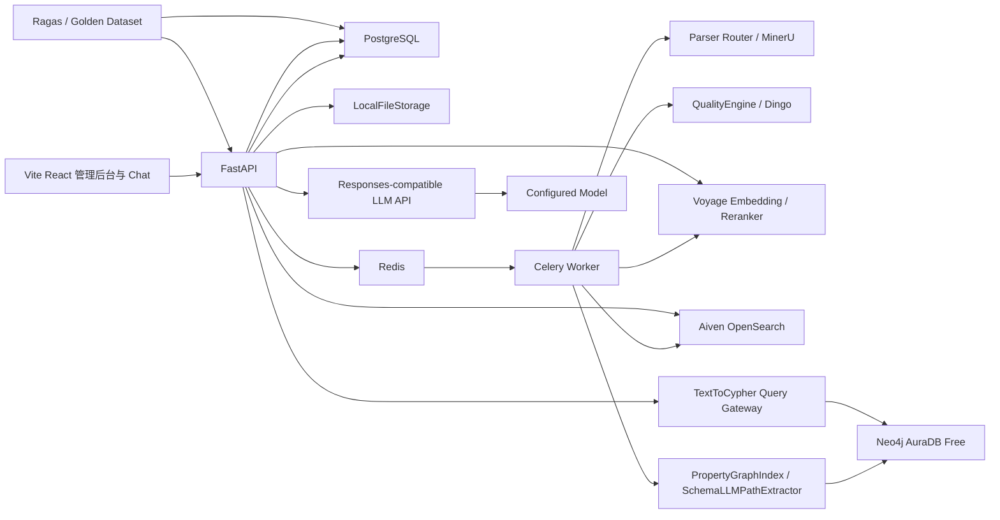
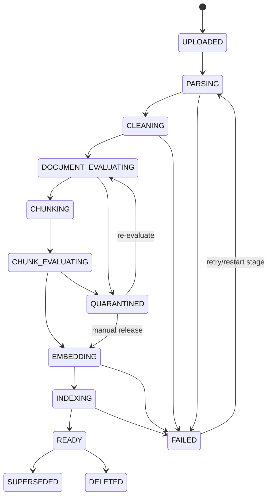
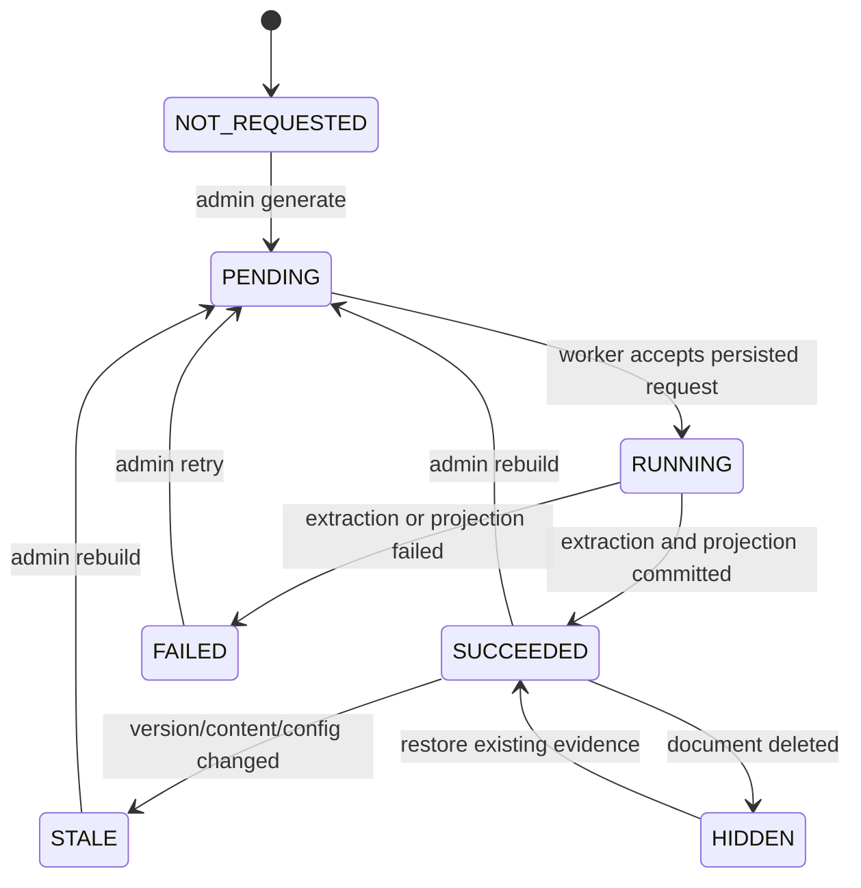
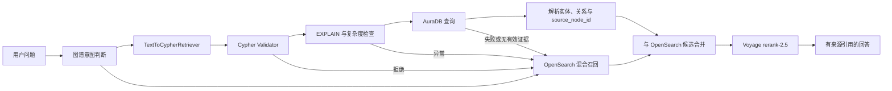

# Robust RAG 完整实施计划

> 文档状态：已确认，可作为实施基线
> 项目类型：中英双语通用企业知识库 RAG
> 当前阶段：阶段 12 实施中
> 最后更新：2026-08-18

## 1. 文档目的

本文档固化项目已经确认的需求、技术决策、系统边界、数据模型、处理流程、质量体系、检索方案、产品范围、实施阶段和验收标准。

实施过程中允许根据真实数据和评测结果调整参数，但以下原则不可在没有记录架构决策的情况下改变：

- 原始文件和解析产物必须可追溯、可重放。
- Canonical Document Model 不绑定具体解析器、分块框架或索引引擎。
- Dingo 负责入库前质量评估，Ragas 负责入库后 RAG 效果评估。
- OpenSearch 是可重建的检索投影，不是数据唯一来源。
- Neo4j 是可重建的知识图谱投影；自动抽取事实必须保留来源证据，人工修正不得被自动重建静默覆盖。
- PostgreSQL 保存持久化业务事实，Redis 只承担队列、短期状态和实时消息职责。
- 所有外部模型和服务必须通过可替换 Adapter 接入。
- 第一阶段只实现纯文本检索，不实现图片理解和多模态检索。

---

## 2. 项目目标

建设一个具备完整数据治理、可靠异步入库、混合召回、父子分块、质量评估、来源引用、离线评测和管理后台的企业知识库 RAG 系统。

### 2.1 业务目标

- 支持企业常见文件上传、解析、质量检查、索引和问答。
- 支持中文、英文及中英混合文档与问题。
- 上传文件完成处理后自动变为可检索状态，无需人工重建索引。
- 知识图谱属于高成本可选增强：文档入库不自动构建，管理员按文档选择、查看调用量与成本预估并确认后才启动。
- 回答严格基于企业知识库内容，并提供可验证的来源引用。
- 对解析失败、质量异常、检索失败和模型调用失败提供可解释状态与恢复能力。
- 通过黄金测试集和可重复评测衡量每次算法、模型和参数变更。
- 使用知识图谱增强实体关系检索和多跳问答，并支持图谱浏览、搜索与人工修正。

### 2.2 初始规模

- 初始文件数：约 50 个。
- 每日新增：约 20 个文件。
- 文件来源：仅管理后台上传。
- 初期并发和响应时间没有正式 SLA，系统必须从第一天记录延迟、吞吐和错误数据。

### 2.3 支持的文件类型

- PDF，包括扫描 PDF 和复杂排版 PDF。
- Word：DOC、DOCX，具体旧格式能力由解析器验证。
- Excel：XLS、XLSX，具体旧格式能力由解析器验证。
- PowerPoint：PPT、PPTX，具体旧格式能力由解析器验证。
- HTML 文件。
- Markdown。
- TXT。

---

## 3. 第一阶段非目标

以下能力明确不属于第一阶段：

- 图片向量、图片检索、图片问答。
- 图表和架构图的 VLM 描述。
- 真正的多模态 RAG。
- 用户登录、组织、角色、权限和 ACL。
- 多租户。
- SharePoint、Confluence、网盘、数据库等数据连接器。
- 复杂 Excel 计算、公式重算和分析引擎。
- Agent、工具调用和互联网搜索。
- 语音和视频。
- Kubernetes 和大规模分布式部署。
- 模型微调。
- 移动端专项适配。

扫描 PDF 的 OCR、PPT 文本框、Excel 单元格、表格文字和公式的文本表达仍属于纯文本处理范围。

---

## 4. 已确认技术栈

| 领域 | 选择 |
|---|---|
| 后端语言 | Python 3.12+ |
| API | FastAPI、Pydantic v2 |
| ORM 与迁移 | SQLAlchemy 2、Alembic、psycopg 3 |
| 异步任务 | Celery |
| Broker | 本机 Redis |
| 持久数据库 | 本机 PostgreSQL |
| 文件存储 | 第一阶段 LocalFileStorage，抽象 S3/MinIO Adapter |
| 解析 | Parser Router；MinerU 云端精准解析 API（Token）为核心，原生解析器覆盖未支持格式 |
| 数据清洗 | 自研可插拔 Cleaning Pipeline |
| 入库质量 | 自研 QualityEngine + Dingo Adapter |
| 分块 | 结构感知父子分块，使用 LlamaIndex 的必要组件但不绑定其数据模型 |
| Embedding | Voyage `voyage-4`，默认 1024 维 |
| 检索引擎 | Aiven for OpenSearch |
| 检索策略 | BM25 + Dense Vector + RRF + Reranker |
| 知识图谱框架 | LlamaIndex `PropertyGraphIndex` |
| 图谱抽取 | `SchemaLLMPathExtractor`，受控 Schema，`strict=True` |
| 图数据库 | Neo4j AuraDB Free |
| 图谱问答 | 受控 `TextToCypherRetriever`，失败时回退 OpenSearch |
| Reranker | Voyage `rerank-2.5` |
| 生成模型 | 可配置的 OpenAI Responses-compatible API 与模型 |
| LLM 接入 | 后端通过 `LLM_BASE_URL`、`LLM_API_KEY`、`LLM_MODEL` 直连服务端 API |
| RAG 评测 | 确定性 IR 指标 + Ragas |
| 前端 | Vite、React 19、TypeScript |
| UI | Tailwind CSS 4、shadcn/ui、AI Elements |
| Chat 状态 | AI SDK UI `useChat` + UI Message Stream |
| 前端数据请求 | TanStack Query |
| 前端路由 | React Router |
| E2E | Playwright |
| Python 测试 | pytest |

建议使用 `uv` 管理 Python 依赖、`pnpm` 管理前端依赖，并在项目初始化时锁定准确版本。版本升级必须经过单元测试、集成测试和黄金集回归。

---

## 5. 总体架构



### 5.1 组件职责

#### FastAPI

- 管理上传、文档、版本、任务、质量报告和 Chat API。
- 验证请求并创建持久化任务。
- 向 Celery 投递任务，不在请求线程中处理长任务。
- 执行在线检索、Rerank、上下文组装和 LLM 流式调用。
- 向前端发送 AI SDK UI Message Stream。

#### Celery Worker

- 执行解析、清洗、Dingo、分块、Embedding 和索引任务。
- 每个阶段独立幂等、可重试。
- 只在任务消息中传递 ID，不传递文件或大段正文。

#### PostgreSQL

- 保存业务对象、不可变版本、处理状态和审计信息。
- 保存 Canonical 元数据、Retrieval Node、质量结果和索引同步状态。
- 保存对话、消息、引用、模型调用和评测结果。
- 作为任务恢复和重建索引的事实来源。

#### Redis

- Celery Broker。
- 短期任务结果和状态缓存。
- 进度实时通知。
- 后续限流、短期缓存和多进程协调。
- 不保存唯一业务数据。

#### LocalFileStorage

- 保存原始文件、解析原始产物、Canonical JSON 和衍生资源。
- 通过接口隔离，将来可切换 S3/MinIO。

#### Aiven OpenSearch

- 保存 READY 文档的检索投影。
- 执行 BM25、Dense Vector、过滤、RRF 和高亮。
- 索引可以从 PostgreSQL 与文件存储完整重建。

#### Neo4j AuraDB

- 保存 READY 当前版本文档抽取出的实体、关系、来源证据和图谱检索投影。
- 使用 LlamaIndex `PropertyGraphIndex` 组织图谱索引，使用 `SchemaLLMPathExtractor` 按版本化 Schema 抽取关系。
- 支持多跳问答、实体和关系搜索、管理后台图形化浏览。
- 自动抽取结果可以从 PostgreSQL、Canonical Document 和 Retrieval Node 重建；Neo4j 不是唯一事实来源。
- 人工新增、修正、合并和驳回通过明确的管理 API 执行，并在 PostgreSQL 保存审计记录。

#### Text-to-Cypher Query Gateway

- 接收 `TextToCypherRetriever` 生成的 Cypher，不允许生成结果绕过网关直接访问 Neo4j。
- 执行 Schema 白名单、只读语句、查询深度、返回数量、复杂度和超时校验。
- 查询失败、校验不通过或图谱未就绪时回退到 OpenSearch 混合召回。
- 图谱查询只返回回答所需的实体、关系和来源 Node ID，不把大规模原始图结果直接交给 LLM。

---

## 6. 核心数据分层

系统采用四层不可混淆的数据模型：

```text
Source Asset
  → Parse Artifact
  → Canonical Document
  → Retrieval Units
```

### 6.1 Source Asset

用户上传的不可修改原始文件和业务文档身份。

### 6.2 Parse Artifact

具体解析器某一次运行产生的原始 JSON、Markdown、表格和资源文件。该层允许多个解析器和多次解析并存。

### 6.3 Canonical Document

与解析器无关的统一结构化文档模型，是清洗、质量、分块和引用的共同输入。

### 6.4 Retrieval Units

面向检索生成的 Parent/Child Node。它们是 Canonical Document 的派生数据，不是原始文档。

---

## 7. PostgreSQL 核心数据模型

### 7.1 Document

表示业务上稳定的一份文档。

```text
document_id
display_name
status
current_version_id
created_at
updated_at
deleted_at
```

### 7.2 DocumentVersion

表示一次不可变文件版本。

```text
document_version_id
document_id
version_number
original_filename
mime_type
file_size
sha256
storage_uri
status
graph_status
graph_active
uploaded_at
ready_at
superseded_at
```

### 7.3 IngestionJob

```text
job_id
document_version_id
job_type
status
current_stage
progress_current
progress_total
attempt
error_code
error_message
started_at
finished_at
created_at
```

### 7.4 StageRun

每个阶段单独审计。

```text
stage_run_id
job_id
stage_name
implementation_name
implementation_version
config_snapshot
status
attempt
input_artifact_uri
output_artifact_uri
started_at
finished_at
error
```

### 7.5 ParseRun

```text
parse_run_id
document_version_id
parser_name
parser_version
parser_mode
parser_config
status
artifact_uri
started_at
finished_at
error
```

### 7.6 CanonicalDocumentRecord

```text
canonical_document_id
document_version_id
schema_version
artifact_uri
language
title
block_count
content_hash
created_at
```

### 7.7 RetrievalNode

```text
node_id
document_id
document_version_id
canonical_document_id
node_level
parent_node_id
previous_node_id
next_node_id
title
heading_path
content
retrieval_text
source_locators_json
content_types
language
token_count
quality_status
quality_summary_json
chunker_version
embedding_status
index_status
created_at
```

### 7.8 QualityAssessment

```text
assessment_id
target_type
target_id
evaluator
evaluator_version
rule_set_version
model
prompt_version
status
dimensions_json
issues_json
raw_result_uri
started_at
finished_at
```

### 7.9 Conversation 与 Message

保存多轮对话、原始问题、改写问题、回答、引用和模型调用关联。

### 7.10 ModelInvocation

统一记录 Voyage、Dingo LLM、图谱抽取、Text-to-Cypher、Ragas Judge 和 GPT 调用：

```text
invocation_id
purpose
provider
model
endpoint
input_tokens
output_tokens
latency_ms
estimated_cost
status
retry_count
trace_id
created_at
```

### 7.11 GraphBuildRequest

记录一次由管理员明确发起的图谱生成授权及其完整生命周期：

```text
graph_build_request_id
batch_id
document_id
document_version_id
request_type
status
requested_by
idempotency_key
force
projection_was_active
celery_task_id
parent_count
estimated_input_tokens
estimated_input_cost_usd
actual_input_tokens
actual_output_tokens
actual_total_tokens
actual_cost_usd
attempt
max_attempts
previous_graph_status
error
requested_at
started_at
finished_at
```

请求状态为 `PENDING / RUNNING / SUCCEEDED / FAILED / CANCELLED`。只有持久化且仍为 `PENDING` 的请求可以进入 LLM；重复投递、目标版本变化和文档删除不得产生新的付费调用。

### 7.12 GraphExtractionRun

记录某个文档版本的图谱抽取与投影状态：

```text
graph_extraction_run_id
graph_build_request_id
document_version_id
schema_version
extractor_name
extractor_version
model
prompt_version
status
entity_count
relation_count
artifact_uri
error
started_at
finished_at
```

完整抽取产物保存在文件存储，PostgreSQL 保存状态与定位信息，Neo4j 只保存当前查询投影。

### 7.13 GraphEntityRecord

保存跨文档稳定的实体身份、规范名称和别名：

```text
entity_id
canonical_key
entity_type
primary_name
aliases_json
properties_json
origin
review_status
schema_version
created_at
updated_at
```

实体规范化和人工合并以 `entity_id` 为稳定身份；名称、别名或显示语言变化不应创建新的业务实体。

### 7.14 GraphFactRecord

为每条自动抽取或人工确认的图谱事实保存稳定身份和来源证据：

```text
graph_fact_id
subject_entity_id
predicate
object_entity_id
document_id
document_version_id
source_node_ids
source_locators_json
origin                # EXTRACTED / MANUAL
confidence
review_status         # UNREVIEWED / APPROVED / REJECTED
schema_version
extraction_run_id
created_at
updated_at
```

同一实体或关系可以由多个来源共同支撑；删除一个文档版本时只移除该版本的证据，不得误删仍被其他来源或人工事实支撑的关系。

### 7.15 GraphCorrectionAudit

记录图谱管理后台的新增、修改、合并、拆分、确认和驳回操作。至少保存操作类型、变更前后快照、原因、时间和关联事实。第一阶段没有登录系统时，操作者使用本机管理员标识；未来接入认证后迁移为真实用户 ID。

---

## 8. Canonical Document Model

### 8.1 顶层结构

```text
CanonicalDocument
  schema_version
  document_id
  document_version_id
  title
  language
  metadata
  root_node_id
  blocks
  assets
```

### 8.2 Block 类型

容器类型：

- DOCUMENT
- SECTION
- PAGE
- SLIDE
- SHEET
- LOGICAL_TABLE

内容类型：

- HEADING
- PARAGRAPH
- LIST
- LIST_ITEM
- TABLE
- TABLE_ROW
- CODE
- QUOTE
- FORMULA
- FOOTNOTE
- CAPTION
- NOTE
- ASSET_REFERENCE

### 8.3 CanonicalBlock

```text
block_id
block_type
parent_block_id
previous_block_id
next_block_id
semantic_order
heading_path
original_text
normalized_text
source_locator
attributes
language
token_count
parser_confidence
quality_status
quality_flags
```

必须保留 `original_text`，清洗只能产生 `normalized_text`，不得覆盖原文。

### 8.4 双重结构

Block 同时保存：

1. 语义结构：章节、标题、父子关系和阅读顺序。
2. 物理来源：页码、幻灯片、工作表、单元格和坐标。

PDF 页面不能作为唯一语义父节点，因为章节可能跨页，一页也可能包含多个章节。

### 8.5 SourceLocator

```text
source_type
page_number
slide_number
sheet_name
cell_range
bbox
dom_path
line_start
line_end
char_start
char_end
```

只填写与当前格式相关的字段，一个 Block 可以关联多个 Locator。

---

## 9. 各格式解析映射

### 9.1 Parser Router

Parser Router 根据 MIME、扩展名、内容签名和文件特征选择解析器。扩展名不能作为唯一判断依据。

接口要求：

```text
Parser.can_handle(file_metadata)
Parser.parse(source_uri, config) -> ParseArtifact
Canonicalizer.convert(parse_artifact) -> CanonicalDocument
```

### 9.2 MinerU 云端精准解析 API 边界

- 生产解析使用 MinerU **精准解析 API**，不部署本地 MinerU，不使用 Agent 轻量解析 API。
- API Base URL 默认为 `https://mineru.net/api/v4`，使用 `Authorization: Bearer <MINERU_TOKEN>` 鉴权；Token 只通过环境变量或密钥管理系统注入，禁止进入日志、数据库、Parse Artifact 和 Git。
- 管理后台上传的本地文件采用官方异步流程：`POST /file-urls/batch` 申请签名上传地址 → `PUT` 上传原件 → `GET /extract-results/batch/{batch_id}` 轮询 → 下载 `full_zip_url`。
- 原始 PDF、Word、PowerPoint 和 HTML 会上传至 MinerU 云端处理；这是已确认的数据边界。签名上传和结果下载请求不得携带 MinerU Bearer Token。
- 默认 `model_version=vlm`，开启表格和公式识别，语言使用 `ch` 以覆盖中英混合文档；HTML 强制使用 `model_version=MinerU-HTML`。
- 精准 API 当前限制为单文件不超过 200 MB、600 页，单批不超过 200 个文件。本项目按一个 Ingestion Job 对应一个文件提交，并在成功产物中保存 `batch_id`、`data_id`、`trace_id` 和模型版本用于审计。
- 当前精准 API 官方格式范围为 PDF、图片、DOC/DOCX、PPT/PPTX、HTML，未列出 XLS/XLSX、Markdown、TXT。因此 PDF、Word、PowerPoint、HTML 走精准 API；XLSX 使用结构感知本地解析器，XLS 先转 XLSX；Markdown/TXT 直接解析。
- 精准 API 的 Zip 结果是外部契约。Adapter 对非 HTML 读取 `content_list.json`，对 HTML 读取 `main.html`，随后转换为内部 `ParseArtifact`。MinerU 输出结构变化只能影响 Adapter，不得泄漏到 Canonical Contract。
- Token 缺失、鉴权失败、上传失败、轮询超时、任务失败、结果下载失败和 Zip 契约不匹配都必须形成明确错误码；禁止静默切换到 Agent 轻量 API 或本地低质量解析器。
- 首版使用 Worker 轮询而不是回调，避免新增公网 Callback 和签名校验面；初期文件量可接受。后续吞吐量增加时再演进为持久化远程任务状态和带 checksum 校验的回调模式。

官方契约：

- [MinerU 文档解析 API](https://mineru.net/doc/docs/)
- [MinerU API Token 管理](https://mineru.net/apiManage/token)
- [MinerU 输出文件说明](https://opendatalab.github.io/MinerU/reference/output_files/)

### 9.3 PDF

- MinerU 为主要解析器。
- 保留标题、段落、列表、表格、公式、脚注、页码和坐标。
- 默认开启 OCR 以覆盖扫描 PDF，可通过环境配置关闭。
- 跨页段落可以合并，但必须保留全部页码。
- 跨页表格合并为逻辑表。
- 页眉、页脚和页码不进入检索正文。
- 低 OCR 置信度产生质量警告，不自动拒绝整份文档。

### 9.4 Word

- 按 Heading 层级组织语义结构。
- 保留段落、列表、表格和脚注。
- 使用最终可见正文。
- 批注和已删除修订不进入检索。
- 页码只在可靠时保存，逻辑结构优先。

### 9.5 PowerPoint

- 每张 Slide 是自然 Parent 候选。
- 提取标题、文本框、表格和演讲者备注。
- 演讲者备注参与检索，标记为 `speaker_note`。
- 图片和图表不进入第一阶段检索。

### 9.6 Excel

- Workbook → Sheet → Logical Table。
- 不把整个工作表简单转换成一个 Markdown 文本。
- 保存工作表、逻辑表、表头、行、公式、显示值和单元格范围。
- 隐藏工作表、隐藏行列默认不参与检索。
- 公式和显示值都保存，检索与回答以显示值为主。
- 只支持检索与问答，不执行复杂计算和公式重算。

### 9.7 HTML

- 按标题、段落、列表、表格和引用形成结构。
- 删除导航、页脚、广告、Cookie 提示、Script 和 Style。
- 保留链接文字与 URL。
- 第一阶段只处理用户上传的 HTML 文件，不抓取动态网页。

### 9.8 Markdown/TXT

- Markdown 按标题树、段落、列表、代码块和表格解析。
- TXT 按空行、编号和可能的标题模式识别结构。
- 无可靠结构时，以文档为根并保留行号。

---

## 10. 入库状态机



### 10.1 可见性原则

- 只有 READY 版本可以进入 Chat 检索。
- 新版本 READY 前，旧 READY 版本继续可检索。
- 新版本成功后原子切换当前版本并移除旧版本检索投影。
- 处理中间状态不能产生部分可检索数据。
- OpenSearch 主检索投影成功后文档可以进入 READY；入库流程到此结束，不自动创建图谱任务。
- 管理员只能为当前 `READY` 版本人工创建图谱任务。`graph_active=true` 的投影可以进入图谱问答；其他文档仍可通过 OpenSearch 服务。
- Agent 选择关系检索工具后直接查询全局有效图谱，不增加文档覆盖率或图谱数量预查询；未人工生成的文档自然不会向 Neo4j 提供证据。
- 图谱抽取与写入必须按文档版本原子切换，不能让半成品关系进入在线查询。

### 10.2 幂等性

- 每个阶段以 `document_version_id + stage + config_version` 作为幂等边界。
- OpenSearch `_id` 使用确定性 `node_id`，重试时覆盖而不新增重复记录。
- 图谱实体键、关系键和来源证据键必须稳定；重复抽取使用幂等 Upsert，不产生重复边。
- Embedding Batch 保存批次状态，成功批次不重复计费。
- Worker 崩溃后根据 PostgreSQL 状态恢复。
- Celery 任务只传 ID，具体状态必须从 PostgreSQL 重新读取。

### 10.3 重复文件与版本

- 上传时计算 SHA-256。
- 同一文档相同内容重复上传时阻止无意义入库并提示。
- 内容变化创建新版本。
- 重复内容但不同业务文档名称时先警告，由管理操作决定是否保留。

### 10.4 独立图谱状态机



`graph_status` 不复用主入库 `status`，也不使用主流程的 `READY`。只有图谱自身完成原子投影后才进入 `SUCCEEDED`。`graph_active` 与最近一次执行状态分离：强制重建失败时可以保留上一次可用投影，同时把最新请求标为 `FAILED`。任务目标在排队或执行期间失效时，`GraphBuildRequest` 转为 `CANCELLED`，投影状态按实际情况回到 `NOT_REQUESTED`、`STALE` 或 `HIDDEN`。

---

## 11. Cleaning Pipeline

第一阶段不引入 Data-Juicer，但预留 DataJuicerAdapter。

### 11.1 清洗原则

- 原文不可修改。
- 所有转换必须可审计。
- 清洗算子独立启停并带版本。
- 结构感知优先于纯文本正则。
- 不套用可能破坏企业文档结构的预训练数据过滤规则。

### 11.2 首版算子

- Unicode 与换行归一化。
- 异常控制字符处理。
- 连续空白规范化。
- 页眉页脚和重复导航清除。
- 明显空 Block 清除。
- 段落阅读顺序修正。
- 精确重复 Block 标记。
- 近重复 Block 识别，但默认只标记不删除。
- 语言识别。
- 表格表头传播准备。
- 来源位置完整性检查。

---

## 12. QualityEngine 与 Dingo

### 12.1 职责边界

- QualityEngine 定义内部评分模型、问题类型、准入策略和审计数据。
- Dingo 是装载到 QualityEngine 的评估器。
- Dingo 不直接修改、删除或发布文档。
- Dingo 输出通过 Adapter 转换，Dingo 数据结构不得成为内部领域模型。

### 12.2 执行顺序

```text
SchemaValidator
  → DeterministicRuleEvaluator
  → DingoRuleEvaluator
  → DingoLLMEvaluator
  → QualityPolicyEngine
```

### 12.3 执行范围

- 确定性规则：所有文档与所有 Child/Parent。
- Dingo 规则：所有文档与所有 Child/Parent。
- Dingo LLM：所有文档。
- Chunk Dingo LLM：异常项、警告项和可配置抽样。
- 初始 Dingo LLM：通过后端配置的 LLM API 调用指定模型；Dingo 使用独立密钥配置，不依赖本地代理。

### 12.4 质量维度

每个维度使用 0～1 分数并保存证据：

- `parse_completeness`
- `text_integrity`
- `structure_integrity`
- `duplication`
- `information_density`
- `context_completeness`
- `source_traceability`
- `retrieval_readiness`

可以生成 UI 总分，但门控不得只依赖总分。

### 12.5 状态

#### REJECTED

- 文件无法解析。
- 没有任何有效文本。
- 文件内容与格式严重不符且无法恢复。
- 全文基本为乱码。
- Canonical Document 无法构建。

#### QUARANTINED

- 大量页面为空。
- OCR 整体质量极低。
- 文本异常或重复比例过高。
- 结构严重损坏。
- 来源定位大量缺失。
- Dingo 发现高风险质量问题。

#### WARNING

- 少量低置信度 OCR。
- 个别表格解析异常。
- 少量重复内容。
- 个别 Chunk 过短或上下文较弱。
- 标题层级或来源位置存在轻微异常。

#### PASSED

没有阻断问题，可以进入后续阶段。

### 12.6 阈值校准

具体数值阈值不得凭经验永久写死。实施时使用初始 50 个文件完成：

1. 人工标注文档质量。
2. 对比确定性规则与 Dingo 输出。
3. 确定阈值初值。
4. 将阈值放入版本化配置。
5. 使用误拒绝率和漏检率回归。

### 12.7 人工放行

QUARANTINED 文档不可检索。管理员可以重跑、重评、拒绝或强制放行。人工操作必须记录操作者、时间、原因、原状态和质量快照。

---

## 13. 父子分块

### 13.1 原则

- 结构边界优先于 Token 长度。
- 不跨越无关章节。
- Child 用于召回，Parent 用于补充完整上下文。
- 标题路径进入检索文本。
- 表格使用独立策略。
- Chunk Schema 与 LlamaIndex 解耦。

### 13.2 Parent

典型 Parent：

- PDF/Word 的小节。
- PPT 的幻灯片。
- Excel 的逻辑表。
- HTML/Markdown 的标题章节。

初始目标长度：约 1,200～2,500 tokens。短章节不强行补齐；超长章节按语义边界拆分为多个 Parent。

### 13.3 Child

初始目标长度：约 350～600 tokens。
初始重叠：约 50～80 tokens，仅允许在同一 Parent 内发生。

`retrieval_text` 组成：

```text
文档标题
标题路径
内容类型
正文
必要表头或上下文标签
```

### 13.4 表格分块

- Parent 保存完整逻辑表或完整可管理片段。
- Child 保存表头与一组行。
- 每个 Child 重复表头，不重复上一批数据。
- 宽表可以转换成键值记录表达。
- 必须保存 Sheet、逻辑表名和 Cell Range。

### 13.5 Node ID

Node ID 必须在同一 DocumentVersion 和相同分块配置下确定稳定，用于：

- 重试覆盖。
- OpenSearch 幂等写入。
- 质量评估关联。
- 引用和评测复现。

---

## 14. Embedding

### 14.1 模型

- `voyage-4`
- 默认维度：1024
- 文档输入使用 `input_type=document`
- 查询输入使用 `input_type=query`

### 14.2 批处理

- 按 Voyage API Token 和条数限制动态分批。
- 保存 Batch、Token 估算、重试次数和失败项。
- 对 429、5xx 和网络错误使用带抖动的指数退避。
- 对不可重试错误进入 FAILED，不无限重试。

### 14.3 版本化

保存：

```text
embedding_provider
embedding_model
embedding_dimension
embedding_config_version
retrieval_text_hash
embedded_at
```

切换模型时新建索引版本，不在原索引中混合不兼容向量。

---

## 15. Aiven OpenSearch 设计

### 15.1 实施前验证

- 确认 Aiven OpenSearch 实例版本。
- 确认 k-NN、ICU Analysis 和 Neural Search 插件可用。
- 推荐版本至少支持 OpenSearch 2.19 的 RRF `score-ranker-processor`。
- 如果实例暂不支持原生 RRF，则临时在应用层融合并记录迁移计划。
- 使用 TLS、CA 验证和独立最小权限服务账号。

### 15.2 索引与别名

```text
rag-documents-v1
rag-chunks-v1

rag-documents-read → rag-documents-v1
rag-chunks-read    → rag-chunks-v1
rag-chunks-write   → rag-chunks-v1
```

模型、Mapping 或分块重大变化时创建 v2，完成重建与评测后原子切换别名。

### 15.3 Chunk Mapping 核心字段

```text
node_id: keyword
document_id: keyword
document_version_id: keyword
parent_node_id: keyword
previous_node_id: keyword
next_node_id: keyword
node_level: keyword
title: text + keyword
heading_path: text + keyword
content: text
retrieval_text: text
language: keyword
content_types: keyword
page_numbers: integer
slide_numbers: integer
sheet_name: keyword
cell_ranges: keyword
quality_status: keyword
quality_score: float
quality_flags: keyword
embedding_model: keyword
embedding: knn_vector, dimension 1024, cosine
document_updated_at: date
```

### 15.4 中英混合字段

- `title.icu`、`content.icu`、`retrieval_text.icu` 用于中英混合检索。
- `standard` 子字段用于英文标准分析。
- 文件名、编号、型号、合同号和路径使用 keyword/专用精确字段。
- 标题、文件名和标识符具有比正文更高的 BM25 权重。
- 需要根据真实文档建立企业词汇、缩写和同义词测试集。

### 15.5 OpenSearch 不是事实来源

- OpenSearch 中只写 READY 当前版本。
- 所有数据均可从 PostgreSQL 和文件存储重建。
- 每次写入保存同步状态和索引版本。
- 删除和版本切换必须验证旧投影已移除。

---

## 16. 知识图谱设计

### 16.1 定位与技术决策

- 知识图谱用于增强实体关系检索、跨段落/跨文档关联和多跳问答，不替代 OpenSearch 混合召回。
- 使用 LlamaIndex `PropertyGraphIndex` 组织图谱构建和检索集成。
- 使用 `SchemaLLMPathExtractor` 按受控 Schema 抽取实体与关系，第一阶段启用 `strict=True`。
- 使用 Neo4j AuraDB Free 承载图谱查询投影。
- 第一阶段使用 `TextToCypherRetriever`，暂不引入 `CypherTemplateRetriever`，避免在真实查询模式尚未形成前维护大量模板。
- Text-to-Cypher 的成功查询和失败样本必须留痕；后续可以将稳定、高频和高风险查询逐步固化为模板，但这不是第一阶段要求。

`SchemaLLMPathExtractor` 要求维护的是实体类型、关系类型、属性约束和允许的三元组组合，而不是人工维护每一条实际关系。Schema 是版本化的系统契约，关系实例由模型抽取、规则校验和人工修正共同产生。

### 16.2 图谱 Schema 与抽取

首版 Schema 遵循“小而稳定、允许演进”的原则：

- 先根据初始 50 份真实文档完成实体类型、关系类型、属性和同义词盘点。
- Schema 必须同时支持中文、英文名称及别名，实体规范化不能只依赖字符串完全相等。
- 每个实体和关系都必须携带稳定业务键、Schema 版本、来源证据和抽取状态。
- 每种关系明确允许的起点类型和终点类型；Schema 外关系在 `strict=True` 下不得写入在线图谱。
- 不确定但可能有价值的候选关系保存在抽取产物中，不直接扩展线上 Schema。
- Schema 变更必须创建新版本，完成重抽取、对比评测和投影切换后再启用。

抽取输入以 Parent 为主要语义单元，必要时携带标题路径、相邻 Child 和表头上下文。不得把整份长文档无边界地交给抽取模型。抽取使用后端配置的 Responses-compatible LLM API 与模型，并记录 Provider、模型、Prompt、Schema、输入哈希、Token、耗时和原始结果位置。

图谱构建采用人工选择模式：文档完成 OpenSearch 索引后保持 `NOT_REQUESTED`，管理端允许勾选一个或多个当前 `READY` 文档；提交前先返回符合质量门禁的 Parent 数、估算输入 Token 与可选费用。用户确认后才持久化 `GraphBuildRequest` 并投递任务。批次中的每份文档独立记录 `GENERATE / REBUILD / RETRY` 类型和状态，单份失败不丢失其他请求的审计结果。

### 16.3 图谱投影与来源证据

Neo4j 至少表达以下逻辑对象：

```text
Entity
Document
DocumentVersion
RetrievalNode
GraphFact / Relation
```

实体和业务关系用于遍历；`DocumentVersion`、`RetrievalNode` 和来源边用于引用与追溯。每条自动抽取关系至少关联一个 `source_node_id`，并能回到页码、幻灯片、Sheet/Cell 或文本行。

投影原则：

- Neo4j 内部 ID 不作为跨系统业务 ID。
- 使用确定性的实体键、关系键和 Retrieval Node ID 进行幂等写入。
- 同一事实允许关联多个来源证据，不因文本重复而复制业务边。
- 自动抽取事实标记 `origin=EXTRACTED`；人工事实标记 `origin=MANUAL`。
- `UNREVIEWED`、`APPROVED`、`REJECTED` 状态必须可区分，具体问答准入策略在图谱阶段通过真实数据校准。
- Neo4j 投影可以从 PostgreSQL、图谱抽取产物和 Retrieval Node 重建。

### 16.4 受控 Text-to-Cypher 检索



Text-to-Cypher 不是数据库直通能力，第一阶段必须满足：

- 只允许单条读取查询；允许的子句使用白名单控制。
- 禁止 `CREATE`、`MERGE`、`DELETE`、`DETACH`、`SET`、`REMOVE`、`DROP`、`ALTER`、`GRANT`、`DENY`、`REVOKE`、`LOAD CSV` 和非白名单过程调用。
- 查询中使用的 Label、Relationship Type 和 Property 必须存在于当前 Schema。
- 禁止无边界变长路径；首版最大关系深度为 3。
- 自动补充或收紧 `LIMIT`，首版最多返回 50 行。
- 先执行 `EXPLAIN`，拒绝明显笛卡尔积、无约束全图扫描和超过复杂度预算的计划。
- 首版查询超时建议为 5 秒，同时限制返回字段和序列化结果大小。
- 校验必须基于可靠的 Cypher 词法/语法分析与结构规则，不能只使用正则表达式。
- LLM、浏览器和前端不得获得 Neo4j 凭据，也不得提交任意 Cypher 执行请求。
- 校验失败、执行失败、超时、图谱未就绪或缺乏来源证据时，自动回退 OpenSearch，不影响基础问答。

查询结果不能作为无来源的“模型知识”直接回答。系统使用返回的 `source_node_id` 找回原始 Retrieval Node，与 OpenSearch 候选合并并经过 Reranker，最终引用仍定位到原文。

### 16.5 图谱浏览、搜索与人工修正

图谱增强问答和管理后台图形化操作共用同一投影，但使用不同应用路径：

```text
问答读取：Question → Text-to-Cypher Gateway → Neo4j Read → Source Nodes
人工写入：Admin UI → Entity/Relation CRUD API → Schema Validation → Audit → Neo4j Write
```

管理后台首版支持：

- 按实体名称、别名、类型和文档来源搜索。
- 以选中实体为中心按深度分页展开，禁止默认渲染全图。
- 查看实体属性、入边、出边、来源片段、抽取版本和审核状态。
- 新增或修改实体与关系、合并重复实体、拆分错误合并、确认或驳回自动事实。
- 每次修正填写原因并保存变更前后快照。

自动重抽取不得静默覆盖人工事实。若新抽取结果与人工修正冲突，应生成待处理冲突；人工确认的别名、合并结果和关系可以被明确撤销，但只能通过管理 API 完成。

### 16.6 一致性、删除与 AuraDB Free 边界

- OpenSearch 是主检索路径，图谱是独立最终一致的增强投影。
- 文档 READY 与 `graph_status` 分离；图谱失败可重试，不把已经可检索的文档回退为不可用。
- 新文档版本进入 READY 后不会自动生成图谱；旧版本图谱随版本切换失效，新版本需要管理员再次选择生成。
- 强制重建采用原子投影；失败时保留原有可用投影，并通过 `graph_active` 与最新请求状态同时表达。
- 软删除文档时同时从在线图谱隐藏其证据；恢复时若证据仍在则直接恢复投影，不产生新的 LLM 调用。
- 排队或执行中的请求遇到删除、重新处理或当前版本变化时转为 `CANCELLED`；晚到结果必须再次校验目标并撤下，不能重新激活失效版本。
- 永久删除时清除该版本的图谱证据，但保留仍被其他文档或人工事实支撑的实体与关系。
- 第一阶段使用 AuraDB Free 普通后端凭据，不把独立只读数据库账号作为上线前置条件。
- Text-to-Cypher 的应用层校验、查询网关、执行限制和审计是第一阶段硬边界；进入正式多用户或敏感数据生产环境时，再评估支持数据库级 RBAC、独立读写凭据、备份和更高可用性的 Aura 规格。

### 16.7 Text-to-Cypher Trace

每次图谱检索至少记录：

```text
trace_id
question
rewritten_question
schema_version
prompt_version
model
generated_cypher
validation_result
explain_summary
returned_row_count
source_node_ids
fallback_reason
latency_ms
error_code
```

日志不得包含数据库密钥。完整 Cypher 仅在管理员调试与评测数据中可见，不直接展示给普通 Chat 用户。

---

## 17. 在线检索流程

### 17.1 初始基线

```text
Query Normalize / Rewrite
  → OpenSearch: BM25 Top 100 + voyage-4 Dense Top 100 → RRF Top 60
  → Graph Router: 必要时运行受控 Text-to-Cypher → Source Node Candidates
  → 合并和去重候选
  → 重复/低信息/低相关候选过滤（无文档硬配额）
  → rerank-2.5 Top 40
  → Cross-Encoder/RRF/词法/Scope 相关性融合
  → 扩大候选池 MMR
  → Parent 自动合并/相邻窗口后选 Context Top 8～12
  → 上下文预算裁剪
  → GPT-5.6 Luna
```

### 17.2 RRF

- 初始 BM25 与 Dense 等权。
- 初始 `rank_constant=60`。
- 参数进入配置，不能硬编码。
- 有黄金集后使用训练/验证拆分调节权重。

### 17.3 候选过滤与多样性

- RRF 到 Reranker 之间不设置单文档或单 Parent 的硬配额。
- 只排除完全重复、同 Parent 高度相似、低信息 heading-only 和明确低于相关性阈值的候选。
- Rerank 后保留并融合 RRF、词法与显式 Scope 信号，再使用相关性权重 0.85 的 MMR 抑制冗余。
- 保留精确编号、文件名和关键词命中结果；精确命中不绕过重复与低信息过滤。

### 17.4 Rerank

- 使用 `rerank-2.5`。
- 输入包含 Query、标题路径、内容类型和 Child 正文。
- 保存输入候选、原始排名、重排分数、模型和耗时。
- 失败时允许配置降级到 RRF 结果，但必须在 trace 中标记。

### 17.5 Parent 自动合并

- 在最终 Context Top K 截断前，同一 Parent 的 Child 命中比例达到阈值时合并为完整 Parent Context。
- 未达到 Parent 阈值但连续命中的 Child 合并为一个相邻窗口。
- 合并后的 Parent 或窗口只占一个 Context 槽位，并保留全部 supporting Child ID。
- 仅在正文截断、列表连续或引用跨块时补充相邻块。
- 表格自动补充表头。
- 去除重复文本后再进行上下文预算裁剪。

### 17.6 图谱候选融合

- 图谱意图判断用于识别实体关系、多跳、依赖链、归属和跨文档关联问题；普通全文事实问答不强制调用 Neo4j。
- 图谱结果必须转换成带来源的 Retrieval Node 候选，再与 OpenSearch 候选进入统一去重和 Rerank。
- 第一阶段不为图谱和 OpenSearch 预设固定融合权重，以黄金集分别评估 `OpenSearch`、`Graph`、`OpenSearch + Graph`。
- 图谱事实可以辅助 Query Rewrite 和补充候选，但不能绕过最终引用与 Grounded RAG 约束。
- `REJECTED` 事实永不用于问答；`UNREVIEWED` 和 `APPROVED` 的准入及降权策略必须通过真实抽取精度和黄金集确定。

---

## 18. LLM 直连 Responses API

### 18.1 配置

```text
LLM_BASE_URL=https://api.openai.com/v1
LLM_API_KEY=<server-side-api-key>
LLM_MODEL=<responses-compatible-model-id>
LLM_API_STYLE=responses
LLM_REASONING_EFFORT=medium
```

`LLM_BASE_URL` 填 API 版本根地址而不是完整 `/responses` 地址，Provider 固定向其下的 `/responses` 发起请求。`LLM_API_KEY` 必须存在且仅保存在后端环境变量中；请求使用 `Authorization: Bearer <API Key>`。`LLM_MODEL` 必须填写目标供应商实际支持的准确模型 ID，业务代码不得写死模型别名。

### 18.2 实施前契约测试

每个目标供应商都必须通过最小真实调用验证：

- Base URL、Bearer 鉴权和准确模型 ID。
- 非流式文本。
- SSE 流式输出。
- Structured Output。
- 多轮输入。
- 错误格式、超时和 Token Usage。

系统只承诺 OpenAI Responses API 契约，不再探测或依赖本地路由代理的健康端点、路由接管、模型映射或客户端身份模拟能力。若供应商只支持 Chat Completions，必须新增独立 Provider，不能在 Responses Provider 内静默转换协议。

### 18.3 Provider 抽象

```text
LLMProvider
  ├── ResponsesAPIProvider
  └── FakeLLMProvider
```

浏览器不得直接调用外部 LLM。调用链固定为 Browser → FastAPI / Celery Worker → Responses-compatible LLM API。生成、Query Rewrite、图谱抽取、Text-to-Cypher 和 Ragas Judge 复用同一套后端 LLM 配置与凭据边界。

### 18.4 Grounded RAG

- 只基于检索上下文回答企业事实。
- 信息不足时明确拒答。
- 不使用模型记忆补充企业事实。
- 回答语言跟随用户问题。
- 每个主要事实尽量带引用。
- 保存 Prompt 模板版本和最终上下文节点。

### 18.5 多轮问答

- 保存对话和消息。
- 检索前生成独立、可检索的 Query Rewrite。
- 只使用解决指代所需的历史，不把完整历史直接拼入检索 Query。
- 保存原始问题与改写问题，便于评测和调试。

### 18.6 引用

引用至少包含：

- 文档名称。
- 标题路径。
- 页码、幻灯片或工作表。
- Node ID。
- 原文片段。

点击引用可以打开来源面板并定位到可用的原始位置。

---

## 19. Chat 流式协议

- 前端使用 `@ai-sdk/react` 的 `useChat`。
- 使用可配置 Transport 指向 FastAPI `/api/v1/chat`。
- FastAPI 实现 AI SDK UI Message Stream，而不是只返回纯文本。
- 使用 SSE 发送文本、来源、状态、用量和错误等 Data Part。

建议事件类型：

```text
data-retrieval-status
data-source
data-usage
data-warning
text-start / text-delta / text-end
```

不得向普通用户发送完整内部 Prompt、全部候选或敏感配置。

---

## 20. 管理后台范围

### 20.1 文档管理

- 单文件与批量拖拽上传。
- 文档列表、搜索和状态筛选。
- 实时处理进度。
- 当前可检索版本与历史版本。
- Parser、配置和质量版本。
- Dingo 质量报告。
- Parent/Child 和来源位置查看。
- OpenSearch 同步状态。
- 图谱抽取、审核和 Neo4j 投影状态。
- 图谱是否有效、最近请求状态、预估/实际 Token 与费用及失败原因。

### 20.2 操作

- 重试失败任务。
- 重新解析。
- 重新清洗。
- 重新运行 Dingo。
- 重新分块。
- 重新生成 Embedding。
- 重新索引。
- 勾选当前 READY 文档，预览 Parent 调用量与输入成本后人工生成图谱。
- 对失败、过期或已有投影的文档人工重试/重新抽取；上传、重新处理和重新索引本身不自动触发图谱。
- 隔离文档人工放行或拒绝。
- 软删除、恢复和永久删除。

重新执行某阶段时，所有依赖其结果的下游产物自动失效。

### 20.3 总览

- 文档总数和 READY 数量。
- 处理中、警告、隔离和失败数量。
- 当日新增和平均处理时间。
- 最近失败任务。
- Dingo 问题类型分布。
- PostgreSQL、Redis、OpenSearch、Neo4j AuraDB、LLM API、Langfuse Cloud 和外部服务状态。

### 20.4 知识图谱管理

- 实体和关系搜索。
- 以实体为中心的局部图可视化和按需展开。
- 实体、关系、来源证据和审核状态详情。
- 实体/关系新增与修改、重复实体合并、错误合并拆分。
- 自动抽取事实确认、驳回和冲突处理。
- 图谱构建批次与单文档请求状态查询。
- 所有写入只调用受控管理 API，不提供任意 Cypher 控制台。

---

## 21. Chat 前端范围

- 新建对话与对话历史。
- 流式回答、停止和重新生成。
- Markdown、代码块和表格。
- 复制回答。
- 来源引用与来源展开面板。
- 文件名、章节、页码、幻灯片、工作表定位。
- 错误与拒答展示。
- 中文、英文和中英混合问答。

管理员调试视图额外显示：

- 原始与改写 Query。
- BM25 和 Dense 候选。
- RRF 排名。
- Reranker 分数。
- 最终 Child、Parent 和相邻块。
- 图谱路由结果、生成 Cypher、校验结果、返回路径和回退原因。
- 最终上下文预算与模型调用信息。

AI Elements 按源码组件集成并允许修改。由于其官方流程偏向 Next.js，实施时必须验证 Vite 路径别名、Tailwind、浏览器组件和流式渲染兼容性。

---

## 22. 删除与恢复

### 22.1 软删除

- 设置 `Document.status=DELETED`。
- 立即从 OpenSearch 移除。
- 立即从在线 Neo4j 投影隐藏该文档版本的来源证据。
- 不再被 Chat 检索。
- PostgreSQL、原始文件和解析产物保留。
- 支持恢复。

### 22.2 永久删除

必须二次确认，删除：

- 原始文件。
- Parse Artifact。
- Canonical Document。
- 文档版本和 Retrieval Node。
- QualityAssessment。
- Embedding 元数据。
- OpenSearch 投影。
- 图谱抽取产物、该版本证据和 Neo4j 投影；不得删除仍由其他来源或人工事实支撑的共享关系。

历史对话引用不级联删除，但显示“来源已删除”。

---

## 23. API 草案

### 23.1 文档

```text
POST   /api/v1/documents/uploads
GET    /api/v1/documents
GET    /api/v1/documents/{document_id}
GET    /api/v1/documents/{document_id}/versions
GET    /api/v1/documents/{document_id}/quality
GET    /api/v1/documents/{document_id}/nodes
POST   /api/v1/documents/{document_id}/retry
POST   /api/v1/documents/{document_id}/reprocess
POST   /api/v1/documents/{document_id}/release
POST   /api/v1/documents/{document_id}/reject
DELETE /api/v1/documents/{document_id}
POST   /api/v1/documents/{document_id}/restore
DELETE /api/v1/documents/{document_id}/purge
```

### 23.2 任务

```text
GET  /api/v1/jobs
GET  /api/v1/jobs/{job_id}
POST /api/v1/jobs/{job_id}/retry
POST /api/v1/jobs/{job_id}/cancel
GET  /api/v1/jobs/{job_id}/events
```

### 23.3 Chat

```text
POST   /api/v1/chat
GET    /api/v1/conversations
POST   /api/v1/conversations
GET    /api/v1/conversations/{conversation_id}
DELETE /api/v1/conversations/{conversation_id}
GET    /api/v1/messages/{message_id}/trace
```

### 23.4 评测与健康

```text
POST /api/v1/evaluations
GET  /api/v1/evaluations
GET  /api/v1/evaluations/{evaluation_id}
GET  /health/live
GET  /health/ready
GET  /health/dependencies
```

### 23.5 知识图谱

```text
GET    /api/v1/graph/search
GET    /api/v1/graph/entities/{entity_id}
GET    /api/v1/graph/entities/{entity_id}/neighborhood
POST   /api/v1/graph/entities
PATCH  /api/v1/graph/entities/{entity_id}
POST   /api/v1/graph/entities/merge
POST   /api/v1/graph/entities/{entity_id}/split
POST   /api/v1/graph/relations
PATCH  /api/v1/graph/relations/{relation_id}
POST   /api/v1/graph/facts/{fact_id}/approve
POST   /api/v1/graph/facts/{fact_id}/reject
GET    /api/v1/graph/conflicts
POST   /api/v1/documents/{document_id}/graph/rebuild
```

第一阶段不提供接收任意 Cypher 的通用 HTTP API。图谱搜索、邻域展开和人工修正均使用受约束的领域接口。

API 实现前应使用 OpenAPI Schema 再次校验命名、分页、错误对象和幂等键。

---

## 24. Ragas 与黄金评测集

### 24.1 黄金集

首版至少 50 个问题，逐步扩展到 100～200 个。

覆盖：

- 中文事实问答。
- 英文事实问答。
- 中英跨语言问答。
- 精确编号、型号和关键词。
- Excel/表格数据查询。
- 多段信息综合。
- 跨文档问题。
- 实体关系和 2～3 跳图谱问题。
- 图谱无结果、错误路径和应回退 OpenSearch 的问题。
- 无答案问题。
- 容易混淆的问题。
- 文档版本问题。

每条样本至少包含：

```text
question
expected_answer 或 rubric
relevant_document_ids
relevant_node_ids/source_locators
answerable
tags
```

### 24.2 确定性指标

- HitRate@5/10
- Recall@5/10
- Precision@5/10
- MRR
- nDCG@10
- Parent 文档召回率
- 引用定位准确率
- 无答案拒答准确率
- Entity/Relation 抽取 Precision、Recall、F1
- 图谱路径命中率和多跳问题答案正确率
- Text-to-Cypher 语法通过率、Schema 合规率、执行成功率和安全拒绝率
- 图谱增强相对 OpenSearch 基线的增益与退化率

### 24.3 Ragas 指标

- Context Precision
- Context Recall
- Faithfulness
- Response Relevancy
- Answer Correctness
- Noise Sensitivity

### 24.4 Judge

- 初期使用 `LLM_MODEL` 配置的 Responses-compatible 模型，模型变更必须记录版本并重跑回归评测。
- 正式发布前对关键样本使用更强或独立 Judge 抽样复核。
- 保存 Judge 模型、Prompt、版本和原始理由。
- LLM Judge 不能替代确定性 IR 指标和人工审查。

### 24.5 回归门槛

任何下列变更都必须运行黄金集：

- Parser 或 OCR 配置。
- Cleaning Rule。
- Dingo/QualityPolicy。
- Chunk Size、Overlap 或 Parent 策略。
- Embedding 模型或维度。
- Analyzer、字段权重和 RRF 参数。
- Reranker 模型和候选数。
- 图谱 Schema、抽取 Prompt、实体归一化、Text-to-Cypher Prompt/Validator 或融合策略。
- Prompt、上下文组装或 LLM。

---

## 25. 可观测性

### 25.1 结构化日志

每条日志尽量包含：

```text
trace_id
request_id
task_id
document_id
document_version_id
chat_id
graph_extraction_run_id
stage
duration_ms
status
error_code
```

### 25.2 核心延迟

- `parse_duration`
- `quality_evaluation_duration`
- `chunk_duration`
- `embedding_duration`
- `indexing_duration`
- `bm25_duration`
- `dense_retrieval_duration`
- `fusion_duration`
- `rerank_duration`
- `graph_extraction_duration`
- `text_to_cypher_duration`
- `cypher_validation_duration`
- `neo4j_query_duration`
- `llm_first_token_duration`
- `llm_total_duration`

### 25.3 成本与用量

记录 Voyage Embedding、Reranker、Dingo LLM、图谱抽取、Text-to-Cypher、Chat LLM 和 Ragas Judge 的 Token、延迟、重试和估算成本。

### 25.4 隐私与日志

- 普通日志不保存完整文档正文、完整 Prompt 和密钥。
- 调试内容通过显式开关启用并标明风险。
- 生产化前增加日志、Trace 和评测数据的保留、删除与脱敏策略。
- 发送到 Langfuse Cloud 前执行本地字段白名单和脱敏；默认不得发送完整文档正文、完整检索上下文、密钥、Authorization Header、Cookie 或连接串。
- Trace 中默认保留模型、Provider、耗时、Token、成本、状态、错误类别、内部资源 ID、配置版本和脱敏后的输入输出摘要；如需上传完整 Prompt 或回答，必须通过独立显式开关启用并标明数据外发风险。

### 25.5 外部可观测性

阶段 12 接入 Langfuse Cloud，并默认启用。Langfuse 用于 LLM/RAG Trace、Generation、Token、成本、延迟和评测分数的查询与可视化；PostgreSQL 继续作为任务状态、领域事实、审计记录和正式评测报告的事实来源，Langfuse 不承担任务恢复和业务一致性职责。

接入原则：

- 使用 OpenTelemetry 兼容的 Trace/Span 语义并封装独立 Adapter，避免业务代码绑定单一平台。
- 一次 Chat Turn、一次评测样本或一次需要模型参与的异步处理作为 Trace；查询改写、BM25、Dense、图检索、融合、Rerank、上下文组装、模型生成和 Ragas Judge 作为子 Span 或 Generation。
- `trace_id` 在 HTTP、Celery 和评测流程间传播，并与 `request_id`、`task_id`、`chat_id`、`document_version_id`、`EvaluationRun.id` 和 `ModelInvocation.id` 关联。
- 阶段 11 的确定性指标和 Ragas 指标写入 Langfuse Score，黄金集、样本结果和正式 JSON/Markdown 报告仍保存在现有版本化数据集与 PostgreSQL 中。
- 默认 `LANGFUSE_ENABLED=true`、`LANGFUSE_SAMPLE_RATE=1.0`、`LANGFUSE_CAPTURE_CONTENT=false` 和 `LANGFUSE_BASE_URL=https://cloud.langfuse.com`；`llm.rag_generation` 按显式诊断要求单独上传完整且凭据脱敏的实际 LLM 请求/响应。部署时通过 `LANGFUSE_PUBLIC_KEY`、`LANGFUSE_SECRET_KEY` 注入凭据，并允许按组织的数据驻留要求切换官方 Cloud 区域。
- SDK 使用后台批量发送、有限队列、短超时和有限重试；Langfuse 凭据缺失、限流、超时或不可用时记录明确告警并丢弃外部 Trace，不得阻塞 Chat、入库、任务恢复或评测报告落库。
- 应用关闭和 Worker 退出时在有限时限内 Flush；不得为了等待 Trace 上传无限阻塞进程退出。
- 管理后台展示 Langfuse 配置、最近成功上报时间和降级状态，但不得展示 Secret Key；可从本地 `trace_id` 跳转到对应 Langfuse Trace。
- 第一阶段不启用 Langfuse Prompt Management，Prompt 继续随代码和配置版本化，避免形成双重事实来源。
- Prometheus Server 和 Grafana 仍不是第一阶段强制依赖；Langfuse 不替代 PostgreSQL、Redis、Celery、OpenSearch、Neo4j 和主机资源的健康指标与告警。

---

## 26. 安全边界

第一阶段没有登录和 ACL，因此必须保持本机边界：

- FastAPI 默认监听 `127.0.0.1`。
- Vite 开发服务器默认仅本机访问。
- Redis 和 PostgreSQL 不暴露到局域网。
- Aiven、Voyage 和模型密钥只在后端环境变量中。
- AuraDB 凭据只在后端环境变量中。
- Langfuse Public Key、Secret Key 和 Base URL 只在后端环境变量中，Secret Key 不得发送到浏览器、日志、数据库或 Trace。
- 浏览器不得直接访问外部模型、Aiven、AuraDB 或 Langfuse 数据写入 API。
- 上传文件名必须清理，防止路径穿越。
- 验证 MIME、扩展名和内容签名。
- 限制文件大小、并发上传和解压资源。
- HTML 解析不执行脚本。
- 文档内容视为不可信输入，Prompt 中明确隔离文档指令。
- Text-to-Cypher 必须经过只读白名单、Schema、深度、LIMIT、`EXPLAIN`、超时和结果大小校验；第一阶段不提供任意 Cypher API。
- AuraDB Free 使用普通后端凭据，不把独立只读账号作为首版阻塞项；生产化时再评估数据库级读写隔离。
- 将来允许局域网或公网访问前必须先增加认证、授权、CSRF/CORS 和审计策略。

Presidio 第一阶段不启用，但保留 PrivacyScanner 接口和外部服务发送策略配置。真实企业文档接入前必须确认是否允许将相应数据发送至 Voyage、配置的 LLM Provider 和 Langfuse Cloud；若不允许发送原始内容，必须保持 Langfuse 内容字段关闭，仅上报脱敏元数据、指标和内部 ID。

---

## 27. Redis 与 Celery 配置原则

- Redis 使用本机现有实例，不使用 Docker Compose。
- Broker 与临时结果使用独立 DB 或 Key Prefix。
- Redis 开启适当持久化。
- Celery Key 使用 `noeviction` 策略，避免任务键被淘汰。
- `visibility_timeout` 大于最长预期任务时长，并对长任务拆分阶段。
- Worker Prefetch 和并发根据真实文件压测配置。
- 任务可重试但必须幂等。
- 外部服务重试使用指数退避与最大次数。
- PostgreSQL 保存最终状态；Redis 丢失后可以扫描未完成 Job 并重新投递。

---

## 28. 配置管理

所有环境配置使用 Settings 对象统一加载，并提供 `.env.example`，不得提交真实密钥。

配置分组：

```text
APP_*
DATABASE_*
REDIS_*
STORAGE_*
MINERU_*
DINGO_*
VOYAGE_*
OPENSEARCH_*
NEO4J_*
GRAPH_*
LLM_*
CHUNKING_*
RETRIEVAL_*
QUALITY_*
EVALUATION_*
LOGGING_*
LANGFUSE_*
```

算法配置必须带版本并保存快照，确保历史结果可复现。

---

## 29. 推荐仓库结构

```text
robust-rag/
├── backend/
│   ├── pyproject.toml
│   ├── alembic.ini
│   ├── migrations/
│   ├── src/robust_rag/
│   │   ├── api/
│   │   ├── application/
│   │   ├── domain/
│   │   │   ├── documents/
│   │   │   ├── ingestion/
│   │   │   ├── quality/
│   │   │   ├── retrieval/
│   │   │   ├── knowledge_graph/
│   │   │   └── chat/
│   │   ├── infrastructure/
│   │   │   ├── database/
│   │   │   ├── storage/
│   │   │   ├── parsers/
│   │   │   ├── dingo/
│   │   │   ├── voyage/
│   │   │   ├── opensearch/
│   │   │   ├── neo4j/
│   │   │   ├── llama_index/
│   │   │   └── llm/
│   │   ├── workers/
│   │   ├── evaluation/
│   │   └── settings.py
│   └── tests/
├── frontend/
│   ├── package.json
│   ├── src/
│   │   ├── app/
│   │   ├── components/
│   │   │   └── ai-elements/
│   │   ├── features/
│   │   │   ├── documents/
│   │   │   ├── ingestion/
│   │   │   ├── quality/
│   │   │   ├── knowledge-graph/
│   │   │   └── chat/
│   │   ├── lib/
│   │   └── routes/
│   └── tests/
├── data/
│   ├── originals/
│   ├── parse-artifacts/
│   ├── canonical/
│   └── fixtures/
├── evals/
│   ├── golden/
│   ├── reports/
│   └── rubrics/
├── scripts/
├── docs/
│   └── IMPLEMENTATION_PLAN.md
├── .env.example
└── README.md
```

`data/` 中运行时文件必须加入 `.gitignore`，测试 Fixture 只放脱敏的小样本。

---

## 30. 测试策略

### 30.1 单元测试

- 文件识别与路由。
- Canonical Schema 验证。
- 清洗算子。
- QualityPolicy。
- 父子分块。
- 表格行组转换。
- RRF、候选卫生过滤与 MMR。
- 引用定位。
- 状态机与幂等性。
- Query Rewrite 输入构建。
- 上下文预算裁剪。
- 图谱 Schema 校验、实体键和关系键稳定性。
- Cypher 词法/结构校验、危险语句拒绝、深度和 LIMIT 限制。
- 图谱与 OpenSearch 候选合并及回退策略。
- 人工事实保护和多来源证据删除规则。

### 30.2 集成测试

- PostgreSQL 迁移和事务。
- Redis/Celery 投递与恢复。
- LocalFileStorage。
- Aiven 测试索引。
- MinerU Adapter。
- Dingo Adapter。
- Voyage Adapter。
- Responses API Provider。
- OpenSearch Alias 切换和删除传播。
- AuraDB 连接、PropertyGraphIndex 投影和重建。
- SchemaLLMPathExtractor 的结构化抽取契约。
- TextToCypherRetriever、Validator、`EXPLAIN`、超时和回退链路。
- Neo4j 文档版本切换与删除传播。

### 30.3 E2E

- 上传文件并查看进度。
- 文档 READY 后可检索。
- 流式回答和引用。
- 失败重试。
- 隔离与人工放行。
- 重新处理下游失效。
- 软删除、恢复和永久删除确认。
- 图谱浏览、搜索、局部展开和来源查看。
- 图谱事实人工确认、驳回、修正、合并和冲突保护。
- 多跳问答、图谱失败自动回退和引用定位。

### 30.4 付费测试隔离

默认测试使用 Fake/Stub，不调用 Voyage 或 GPT。真实调用使用显式命令和环境开关，例如：

```text
integration-live
eval-golden
```

真实评测报告必须保存模型、参数、成本和运行时间。

---

## 31. 分阶段实施计划

### 阶段 0：项目骨架与开发基线（已完成）

任务：

- 初始化 Python 与 Vite/React 项目。
- 建立依赖锁文件、格式化、Lint、类型检查和测试命令。
- 建立 Settings、错误模型、日志和 Trace ID。
- 创建 `.env.example` 和本地启动说明。

验收：

- 后端、Worker 和前端均可本机启动。
- CI 可运行静态检查与无外部费用的测试。

### 阶段 1：数据库、存储与异步任务（已完成）

任务：

- 建立 Document、Version、Job、StageRun 等表。
- 实现 Alembic 迁移。
- 实现 LocalFileStorage 和安全上传。
- 接入 Redis/Celery。
- 实现状态机、进度、重试和恢复扫描。

验收：

- 上传后立即返回 Job。
- Worker 重启后任务不会静默丢失。
- 相同文件重复上传可识别。

### 阶段 2：Parser Router 与 Canonical Model（已完成）

任务：

- 定义 Canonical Schema 和版本。
- 实现 Parser 接口、MinerU Adapter 和轻量原生解析器。
- 完成各格式映射。
- 保存 Parse Artifact 与 Canonical JSON。

验收：

- 所有目标格式有成功与失败 Fixture。
- Block 可追溯到页、幻灯片、Sheet/Cell 或行号。
- 解析结果可重放。

完成记录（2026-08-17）：

- 已实现版本化 `parse-artifact/1.0` 与 `canonical-document/1.0` Schema。
- PDF 使用 MinerU HTTP Adapter，并把 `content_list.json` v1 隔离在适配层；V2 暂不作为内部契约。
- DOCX、PPTX、XLSX 使用轻量原生解析器；DOC、PPT、XLS 经可选 LibreOffice 转换后复用原生解析器。
- HTML、Markdown、TXT 使用结构感知原生解析器，保留列表、标题、代码、表格和来源位置。
- ParseRun、CanonicalDocumentRecord、StageRun 与文件产物均已持久化；PostgreSQL advisory lock 防止同一 Job 并发重复解析。
- 已提供 Canonical 元数据、正文和 ParseRun 查询 API，并完成真实 PostgreSQL + Redis + Celery 端到端验收。
- 27 个后端测试通过，覆盖全部目标格式的成功映射、签名失败、解析失败、幂等与可重放路径。

架构修订（2026-08-17）：

- 已确认使用需要 Token 的 MinerU 云端精准解析 API，不再规划本地 MinerU 服务或 Agent 轻量解析 API。
- PDF、DOC/DOCX、PPT/PPTX、HTML 改走签名上传、异步轮询和 Zip 下载流程。
- 精准 API 当前未声明支持 XLS/XLSX，因此 Excel 保留本地结构感知解析；Markdown/TXT 继续直接解析。
- 本修订不改变 `parse-artifact/1.0` 与 `canonical-document/1.0`，只替换 MinerU Adapter、Parser Router 和运行配置。
- 修订后 29 个后端测试通过，包含精准 API 签名上传、轮询、ZIP、HTML 模型和 Token 安全契约测试。

### 阶段 3：Cleaning Pipeline（已完成）

任务：

- 实现结构感知清洗算子。
- 实现原文/规范文本分离。
- 记录每个算子版本和问题。

验收：

- 清洗不覆盖原文。
- 清洗结果可独立重跑和比较。

完成记录（2026-08-17）：

- 已实现 `structure-aware-cleaning-pipeline/1.0.0` 与版本化 `cleaning-report/1.0`，每个算子保存名称、版本、配置、变更 Block、移除 Block 和问题记录。
- 已实现 Unicode/换行、控制字符、结构感知空白、阅读顺序、重复页眉页脚、空 Block、精确重复、近重复、语言识别、表头准备和来源定位完整性算子。
- 清洗始终从阶段 2 原始 Canonical 产物重建工作副本，只修改 `normalized_text` 和清洗投影，不覆盖 `original_text` 或原始 Canonical 文件。
- 已新增 CleaningRun 持久化、Alembic 迁移、清洗后 Canonical/报告文件、幂等执行、失败审计以及不同配置运行的比较 API。
- Worker 已串联 PARSING → CLEANING；阶段 4 会继续执行 DOCUMENT_EVALUATING，并按准入结论推进、隔离或拒绝。
- 35 个后端测试通过，整体覆盖率 88%，包含原文不可变、结构修复、算子审计、幂等重跑、配置隔离、产物查询和运行比较。

### 阶段 4：QualityEngine 与 Dingo（已完成）

任务：

- 定义质量维度、Issue Schema 和 Policy。
- 实现确定性规则。
- 接入 Dingo 规则和 LLM 评估。
- 实现 PASSED/WARNING/QUARANTINED/REJECTED。
- 实现质量报告和人工放行。

验收：

- 高风险文档不会进入 Embedding。
- Dingo 故障可见并可重试。
- 所有决策具备证据与版本。

完成记录（2026-08-17）：

- 已实现 `quality-engine/1.0.0`、`quality-report/1.0`、八维评分、版本化规则/Policy 配置以及 PASSED、WARNING、QUARANTINED、REJECTED 四级准入。
- 已实现 Canonical Schema 校验和确定性质量规则，覆盖空正文、结构环/孤儿 Block、乱码、重复、空页、OCR 低置信度、信息密度、标题层级、上下文与来源定位。
- 已按 Schema → 确定性规则 → Dingo Rule → Dingo LLM → Policy 顺序执行；Dingo 通过独立 Adapter 接入，锁定可选依赖 `dingo-python==2.5.0`，默认关闭且不产生外部费用。
- 已新增 QualityAssessment、StageRun、`quality_review_actions`、Alembic 迁移和持久化报告；同输入和版本幂等复用，重新评估会保留历史并创建新记录。
- 已提供质量列表、报告、人工操作历史、放行、拒绝和重新评估 API；人工操作保存操作者、原因、原状态和质量快照。
- Worker 已串联 PARSING → CLEANING → DOCUMENT_EVALUATING；通过/警告进入 CHUNKING，隔离/拒绝不会进入后续 Embedding。Dingo 故障保存可重试标记，可使用 Job Retry 恢复。
- 47 个后端测试通过，整体覆盖率 87.65%；PostgreSQL 离线迁移编译通过，包含 Dingo 官方状态/评分转换、门禁、幂等、失败重试和人工审计测试。

### 阶段 5：父子分块（已完成）

任务：

- 实现各格式结构感知 Parent 策略。
- 实现 Child Token 控制与同 Parent 重叠。
- 实现表格分块和表头传播。
- 实现稳定 Node ID 和来源合并。

验收：

- Child 不跨无关章节。
- 每个 Child 能恢复 Parent 和来源位置。
- 表格 Child 始终具有表头上下文。

完成记录（2026-08-17）：

- 已实现 `structure-aware-parent-child-chunker/1.0.0`、`retrieval-node/1.0`、`chunking-artifact/1.0` 和 `chunking-report/1.0`。
- Parent 优先使用标题章节、Slide、Logical Table 和页面边界；超长内容在原结构范围内拆分，短章节不跨边界补齐。
- Child 使用版本化 Token 目标、最大长度和同 Parent 重叠；检索文本包含文档标题、标题路径、内容类型、来源标签和正文。
- 表格按行分割可管理 Parent/Child，每个片段重复表头且不重复上一批数据，保留 Sheet 和 Cell Range。
- Node ID 使用 UUIDv5 稳定生成；每个 Child 可恢复 Parent、前后节点、Canonical Block 和合并后的 SourceLocator。
- 已新增 ChunkingRun、RetrievalNode、Alembic 迁移、节点/报告文件、幂等执行、失败审计和查询 API。
- Worker 已串联 PARSING → CLEANING → DOCUMENT_EVALUATING → CHUNKING；成功后进入 CHUNK_EVALUATING，隔离文档仅在存在人工放行审计时允许分块。
- 54 个后端测试通过，覆盖章节隔离、同 Parent 重叠、表头传播、来源位置、稳定 ID、人工放行、API、幂等和失败重试。

### 阶段 6：Embedding 与 OpenSearch（已完成）

任务：

- 接入 `voyage-4`。
- 实现批处理、重试和成本记录。
- 配置 Aiven OpenSearch、ICU、k-NN、Mapping 和 Alias。
- 实现幂等索引、删除传播和重建工具。

验收：

- READY 文档可以 Dense 和 BM25 检索。
- 索引删除后可以完整重建。
- 新旧索引可通过 Alias 切换。

完成记录（2026-08-17）：

- 已实现可替换的 Voyage Adapter，默认 `voyage-4`/1024 维/document input type，严格校验返回顺序、数量和维度。
- 已实现按条数与估算 Token 动态分批、429/5xx/网络错误指数退避、不可重试错误终止，以及 Batch/Token/重试/估算成本持久化审计。
- Retrieval Node 保存向量和 Provider/模型/维度/配置/文本哈希/时间；OpenSearch 删除后可直接从 PostgreSQL 重建，无需重复 Embedding。
- 已实现节点级入库门禁，并将 Worker 串联为 CHUNK_EVALUATING → EMBEDDING → INDEXING → READY；配置缺失和外部失败均形成明确 Job/StageRun 错误。
- 已实现 Aiven OpenSearch 版本/插件检查、ICU 中英多字段、Faiss HNSW cosine `knn_vector`、严格 Mapping、不可见预写、数量核对和激活。
- 已实现稳定 `_id` 幂等覆盖、旧版本删除验证、业务文档删除传播、全量/单文档重建和文档/Chunk 读写 Alias 原子切换。
- OpenSearch Adapter 已提供 Child BM25 与 Dense 查询契约，阶段 7 将继续实现 Query Normalize、RRF、多样性和 Reranker。
- 新增 EmbeddingRun、EmbeddingBatch、IndexingRun、Retrieval Node 向量字段、Alembic `20260817_0006` 迁移、审计查询与管理 API。
- 60 个后端测试通过，覆盖批次重试、成本、幂等、READY BM25/Dense、索引删除重建、Alias v1→v2、删除传播和 Worker 串联；真实外部联调等待凭据。

### 阶段 7：混合召回与 Reranker（已完成）

任务：

- 实现 Query Normalize 和 Query Rewrite 接口。
- 实现 BM25、Dense、RRF、候选卫生过滤和 MMR。
- 接入 `rerank-2.5`。
- 实现 Parent/相邻块扩展和上下文预算。
- 保存完整 Retrieval Trace。

验收：

- 可独立运行 Dense、BM25、Hybrid 和 Hybrid+Rerank 对照。
- 调试视图能解释最终上下文来源。

完成记录（2026-08-17）：

- 已实现 NFKC、零宽字符、空白和标点归一化，并定义可替换 Query Rewrite 接口；阶段 7 使用可复现的 Identity 基线，阶段 8 可接入多轮会话改写。
- 已实现 BM25、Dense、Hybrid 和 Hybrid+Rerank 四种独立模式；Dense 查询固定使用 Voyage `input_type=query`。
- 已实现应用层加权 RRF 和稳定并列排序；2026-08-21 移除单文档/单 Parent 硬配额，并进一步加入受控 Scope、结构关键词、Cross-Encoder/RRF/词法/Scope 混合相关性和扩大候选池 MMR。
- 已按官方契约接入 `rerank-2.5`，保存 Token、重试、延迟和可选成本；Reranker 故障默认降级到 RRF 并明确标记 `degraded`。
- 已将按命中比例合并 Parent 和连续窗口提前到最终 Context 截断前，并保留单 Child/相邻块回退、内容去重和 Token 预算上限。
- 已新增 RetrievalTrace、Alembic `20260817_0007` 迁移以及检索、Trace 列表和 Trace 详情 API；调试响应可解释从召回到最终上下文的每个阶段。
- 在线补全只接受 PostgreSQL 中当前 READY、ACTIVE 且已成功索引的 Child，避免 OpenSearch 残留旧版本进入上下文。
- 65 个后端测试通过，整体覆盖率 83% 以上；迁移离线编译通过，真实 Aiven/Voyage 联调等待凭据。

### 阶段 8：Responses API 与 RAG Generation（已完成，2026-08-18 改为直连）

任务：

- 完成可配置 Responses API 的契约测试。
- 实现 Responses Provider 和 Fake Provider。
- 实现 Grounded Prompt、拒答、引用和多轮 Query Rewrite。
- 实现 AI SDK UI Message Stream。

验收：

- 流式回答稳定。
- 无上下文问题明确拒答。
- 引用可回到原始来源位置。
- LLM API 鉴权失败、限流或不可用时错误可解释。

完成记录（2026-08-17）：

- 已实现可替换的 `LLMProvider`、`ResponsesAPIProvider` 和零费用
  `FakeLLMProvider`；Base URL、API Key 与准确模型 ID 均由后端环境变量配置，业务层不依赖供应商原始响应。
- 已实现 OpenAI Responses 非流式与 typed SSE 契约，覆盖文本/拒答增量、完成、用量、HTTP、
  超时、连接、畸形流和未完成流错误，并限制只在首个文本增量前重试。
- 已实现版本化 Grounded Prompt、文档指令隔离、无上下文确定性中英文拒答、`[S1]` 引用解析
  与包含文档名、标题路径、Node ID、来源位置和原文片段的不可变 Citation 快照。
- 已实现服务端持久化多轮 Query Rewrite；只使用已保存的有限历史解决指代，保存原始/改写问题、
  Prompt 版本与调用 ID，改写失败时降级为当前问题并显式发送 Warning。
- 已实现 AI SDK UI Message Stream v1，发送会话、检索状态、来源、Warning、文本、用量、错误和
  完成 Data Part，并设置防缓存/代理缓冲响应头；浏览器不会得到内部 Prompt、密钥或原始错误。
- 已新增 Conversation、Message、Citation、ModelInvocation、Alembic `20260817_0008` 迁移、
  会话历史 API 和消息 Trace API；模型调用保存用途、Provider、模型、Prompt、Token、重试、耗时、
  可选成本与结构化错误。
- 70 个后端测试通过，整体覆盖率 84% 以上；真实 LLM API 的文本、SSE、多轮、Usage 和 Structured Output 契约测试已提供为显式
  `integration_live` 测试，默认跳过以避免隐式产生外部费用。

### 阶段 9：知识图谱构建与检索（已完成）

任务：

- 使用真实文档完成首版实体、关系、属性和允许三元组 Schema 设计并版本化。
- 接入 Neo4j AuraDB Free，完成连接、约束、索引、健康检查和重建工具。
- 集成 LlamaIndex `PropertyGraphIndex` 与 `SchemaLLMPathExtractor(strict=True)`。
- 实现实体归一化、稳定 ID、多来源证据、审核状态和文档版本投影切换。
- 实现受控 `TextToCypherRetriever`、Cypher Validator、`EXPLAIN`、执行限制和 OpenSearch 回退。
- 将图谱 Source Node 候选接入统一 Rerank、上下文组装和引用链路。
- 实现 GraphExtractionRun、GraphEntityRecord、GraphFactRecord、GraphCorrectionAudit 和完整 Trace。

验收：

- 每条在线自动关系都符合当前 Schema 并至少具有一个可定位来源。
- 重复抽取和任务重试不产生重复实体或关系。
- Text-to-Cypher 的写入语句、Schema 外字段、无界路径和超限查询被拒绝。
- 2～3 跳样本可以返回可解释路径和原文引用。
- Neo4j 不可用、图谱未就绪或查询失败时自动回退 OpenSearch。
- Neo4j 投影可以从 PostgreSQL 和图谱抽取产物完整重建。

实现记录（2026-08-17）：

- 已新增版本化 `enterprise-core-v1` Schema、规范化规则、UUIDv5 稳定实体/事实键和多来源证据模型。
- 已接入 LlamaIndex `PropertyGraphIndex`、`SchemaLLMPathExtractor(strict=True)`、Responses API Structured Output 适配器与独立 `graph.extract` Celery 任务。
- 已新增 Neo4j 约束、索引、健康检查、版本隐藏、清理与 PostgreSQL 全量重建能力；图谱状态与文档 `READY` 分离。
- 已实现受控 `TextToCypherRetriever` 网关、词法/结构 Validator、来源字段要求、`EXPLAIN`、复杂度/超时/行数限制及 OpenSearch 回退。
- 已将图谱 Source Node 接入 RRF、统一 Rerank、上下文、引用和 Retrieval Trace，并新增图谱搜索、邻域、人工记录、审核与重建 API。
- 已应用 Alembic `20260817_0008` 与 `20260817_0009`，数据库迁移到最新 Head；阶段 8/9 新增表和字段已在 PostgreSQL 中完成结构核验。
- 97 个后端测试通过、1 个真实外部集成测试默认跳过，整体覆盖率 83.43%；Ruff、Mypy、前端测试和生产构建均通过。
- 详细配置、边界和验证说明见 `docs/STAGE9_KNOWLEDGE_GRAPH.md`。

人工构建改造记录（2026-08-19）：

- 已移除索引成功后的自动图谱投递；新文档版本默认 `graph_status=NOT_REQUESTED, graph_active=false`，OpenSearch READY 流程不受影响。
- 已新增批量预览、批量创建和批次查询 API，以及持久化 `GraphBuildRequest`；记录生成/重建/重试类型、请求人、任务 ID、预估与实际 Token/费用、尝试次数、错误和终态。
- 已实现 `NOT_REQUESTED / PENDING / RUNNING / SUCCEEDED / FAILED / STALE / HIDDEN` 投影状态，以及 `PENDING / RUNNING / SUCCEEDED / FAILED / CANCELLED` 请求状态；列表、版本详情和管理操作均返回并展示相关状态。
- 已限制只有人工授权且仍为 `PENDING` 的请求可以启动 LLM；重复投递不重复执行，僵死任务仅在原请求上限内恢复，目标版本变化或删除后的晚到结果会取消并撤下。
- Chat/Agent 流程保持不变：`retrieve_enterprise_relationships` 直接查询全局有效图谱并沿用 OpenSearch 融合/回退，不增加图谱文档数量或覆盖率查询。

### 阶段 10：管理后台与 Chat UI（已完成）

任务：

- 实现文档、任务、质量和系统状态页面。
- 实现 Chat、历史、引用和调试视图。
- 实现知识图谱搜索、局部图浏览、来源查看和审核状态页面。
- 实现实体/关系修正、合并、拆分、确认、驳回和冲突处理界面。
- 适配 AI Elements 到 Vite。
- 实现软删除、恢复、隔离和重处理流程。

验收：

- 全部核心流程可以不借助命令行完成。
- 错误、等待、空状态和重试状态完整。

完成记录（2026-08-17）：

- 已实现总览、文档、任务、Chat、知识图谱和系统状态六个管理页面，覆盖上传、筛选、进度、质量审核、重试、重处理、重建、删除、恢复与永久删除。
- 已实现 AI SDK UI Message Stream v1 浏览器消费、对话历史、停止/重新生成、AI Elements `MessageResponse` 的 Vite 源码适配、流式 Markdown/代码/表格、复制回答、来源详情和管理员 Trace。
- 已实现图谱搜索与局部可视化、实体/关系新增修改、事实确认/驳回、实体合并/拆分、关系纠错和冲突解决/忽略；人工操作均保留审计。
- 已补齐文档搜索与状态筛选、重新处理、软删除恢复和带显示名二次确认的永久删除 API，并同步维护 OpenSearch 与可选 Neo4j 投影。
- 已新增并应用 Alembic `20260817_0010`，数据库核验为最新 Head；迁移全链路 PostgreSQL 离线编译通过。
- 后端 98 项测试通过、1 项真实外部集成测试默认跳过，覆盖率 83.17%；前端 ESLint、TypeScript、生产构建和 15 项测试通过，语句覆盖率 94.66%。
- 已完成桌面和 390×844 窄屏浏览器检查，无控制台错误和横向溢出；详细说明见 `docs/STAGE10_ADMIN_UI.md`。

### 阶段 11：Ragas 与黄金集（已完成）

任务：

- 建立黄金集 Schema 和首批 50 个问题。
- 增加实体关系、2～3 跳、多文档图谱和回退样本。
- 实现确定性 IR 指标。
- 实现图谱抽取、路径命中、Text-to-Cypher 合规率和图谱增益指标。
- 接入 Ragas。
- 生成基线报告和后续回归门槛。

验收：

- 任一检索配置可以生成可比较报告。
- 报告包含模型、参数、数据集版本、成本和失败样本。

完成记录（2026-08-17）：

- 已建立 `golden-dataset/1.0` Schema 和 `enterprise-golden-v1` 首批 50 条中英双语种子样本，覆盖事实、跨语言、精确编号、表格、跨文档、2～3 跳图谱、回退、安全拒绝、无答案、歧义和版本问题。
- 已实现 HitRate/Recall/Precision@5/10、MRR、nDCG@10、父文档召回、引用定位、拒答、实体关系 P/R/F1、图谱路径命中及 Text-to-Cypher 语法、Schema、执行和安全拒绝指标。
- 已实现同问题 OpenSearch 基线与图谱增强配对，统计图谱增益/退化，并支持以历史运行作为基线执行可配置阈值回归。
- 已接入锁定版本 Ragas 0.2.15 的六项指标，Judge 使用配置的 LLM API、Embedding 复用生产 Voyage Adapter；默认测试和检索评测不产生外部费用。
- 已新增 EvaluationRun、EvaluationSampleResult、三个评测 API，以及同时输出 JSON/Markdown 的可比较报告；Alembic `20260817_0011` 已应用，本机 PostgreSQL 已核验为最新 Head。
- 103 个后端测试通过、1 个真实外部集成测试默认跳过，整体覆盖率 82.75%；Ruff、Mypy、Ragas 真实导入/六指标接口契约及 PostgreSQL 离线迁移均通过。
- 详细数据集维护、运行、回归门槛与费用边界见 `docs/STAGE11_EVALUATION.md`。

### 阶段 12：可观测性、异常恢复与安全加固

任务：

- 完成结构化日志、健康检查、耗时和成本统计。
- 接入并默认启用 Langfuse Cloud，建立 Chat、检索、图谱、模型调用和阶段 11 评测的端到端 Trace/Span/Generation/Score。
- 配置 Langfuse 本地脱敏、100% 默认采样、异步批量发送、有限超时/重试/Flush 和失败降级；补充管理后台上报状态与 Trace 跳转。
- 为 PostgreSQL、Redis、Celery Worker/Beat、队列积压、OpenSearch、Neo4j、外部模型和 Langfuse 增加可判定的健康与降级状态。
- 压测任务恢复、外部限流、超时和网络失败。
- 压测 AuraDB 故障、异常 Cypher、超时、图谱重建和版本切换。
- 验证上传安全、路径安全、HTML 安全，以及日志和 Langfuse Trace 的密钥/敏感内容保护。
- 完成操作手册和故障处理手册。

验收：

- 依赖异常不会造成静默数据不一致。
- 管理后台可以定位文档停在哪个阶段。
- 关键任务可以安全重试。
- 一次 Chat、异步模型处理或评测可以通过同一 `trace_id` 定位完整调用链，并查看各阶段耗时、Token、成本、错误和降级状态。
- 阶段 11 的确定性指标与 Ragas 指标可以关联到 Langfuse Trace，同时本地正式报告不依赖 Langfuse 可用性。
- 默认配置启用 Langfuse Cloud；有效凭据下 Trace 能成功上报，凭据缺失、限流、超时和服务中断均不会阻塞核心流程，并产生可定位告警。
- 默认上报内容不包含完整文档、完整检索上下文、密钥、认证信息和连接串；脱敏与内容开关有自动化测试。
- Langfuse 故障恢复后新 Trace 可继续上报，应用和 Worker 可以在有限时间内安全退出。

实施进展（2026-08-18）：

- 已接入 Langfuse Python SDK 4.14.4，默认启用、100% 采样并关闭完整内容采集；凭据缺失或 Cloud 故障时降级，不影响业务事务和本地审计。
- 已实现 HTTP/Celery Trace ID 传播，以及 BM25、Embedding、Dense、图检索、Rerank、查询改写、流式生成和阶段 11 评测的 Span/Generation/Score。
- 已实现统一日志/Trace 敏感字段脱敏、模型首 Token 耗时、Token/成本与应用 Trace 关联；Provider Response ID 不再冒充 Trace ID。
- 已增加 Worker/Beat 心跳、队列深度、Langfuse 与 Provider 配置状态，并在管理后台系统页展示非敏感状态。
- Celery 子进程在 fork 后使用独立 Langfuse exporter；所有任务在 `task_postrun` 后有限时 flush，子进程退出时 shutdown，并通过 Redis TTL 快照暴露 Worker 侧最近 flush 状态，避免 API 健康掩盖 Worker 遥测失败。
- Celery 已启用 Late Ack、Worker Lost 重投和单任务预取；恢复扫描增加数据库行锁与 `skip_locked`。
- 已新增并应用 Alembic `20260818_0012`，修复阶段 11 评测字段声明差异；本机 PostgreSQL 的模型与迁移一致性检查通过。
- 已新增阶段 12 操作与故障处理手册 `docs/STAGE12_OBSERVABILITY.md`。
- 本机尚未配置 Langfuse Cloud 凭据，因此真实 Cloud Trace 上报、内容复核和 Cloud 故障演练仍待凭据完成后验收。

### 阶段 13：LangGraph Agentic RAG 改造

目标：

- 将阶段 8 当前固定的 `Query Rewrite → Hybrid + Rerank → Grounded Generation` 流水线改造为简化、受控的 LangGraph Agentic RAG 状态图。
- 由绑定受控工具的 Agent LLM 根据服务端对话历史自主决定直接回答、调用企业文档检索或调用企业关系检索；不在 Agent 前增加 `fast_path`，也不维护独立的问候/闲聊意图分类器。
- 保留现有 Retrieval、Text-to-Cypher、引用、持久化、Responses API、AI SDK UI Message Stream 和 Langfuse 能力，LangGraph 只负责在线 Chat 编排，不成为新的业务事实来源。

目标状态图：

```text
START
  → Agent（LLM + 受控 Tools）
      ├─ 普通文本 → Direct Response → END
      ├─ retrieve_enterprise_documents
      │    → OpenSearch Hybrid + Rerank
      │         ├─ 有来源 → Grounded Generation → END
      │         └─ 无来源 → Deterministic Refusal → END
      └─ retrieve_enterprise_relationships
           → OpenSearch + 受控 Text-to-Cypher + Rerank
                ├─ 有来源 → Grounded Generation → END
                └─ 无来源 → Deterministic Refusal → END
```

为降低首版复杂度、延迟和外部模型故障面，在线主流程不使用 Context Grader，也不在检索后形成 LLM 评分与 Query Rewrite 循环。Context Grader 的重新设计保留在 `docs/CONTEXT_GRADER_REDESIGN_PLAN.md`，后续只有在黄金集和影子评测证明存在稳定净收益时才单独立项。

Agent 决策原则：

- 问候、感谢、能力介绍和不涉及企业事实的普通交流由 Agent 直接回答，不调用检索工具。
- 涉及企业制度、文档、人员、项目、产品、系统、流程或其他企业事实时必须调用工具，不得用模型记忆直接回答。
- 普通事实、定义、日期、操作说明和全文内容优先调用 `retrieve_enterprise_documents`。
- 实体关系、依赖链、归属关系、影响范围和 2～3 跳问题调用 `retrieve_enterprise_relationships`。
- Agent 不直接接收或执行 Cypher；Text-to-Cypher 仍只能在阶段 9 的受控网关内运行，并继续经过只读白名单、Schema、路径深度、`LIMIT`、`EXPLAIN`、超时和结果大小校验。
- 条件边只读取 LLM 是否产生 Tool Call 及受控 Tool 名称，不在代码中重复实现业务意图分类。
- Agent 决策失败、输出非法 Tool Call 或无法确定是否涉及企业事实时，安全回退企业文档检索；图谱检索失败时回退企业文档检索。

任务：

- 使用实施时最新稳定版 LangGraph 1.2.11，并将兼容的 LangChain Core 加入后端正式依赖；同步升级阶段 11 的 LangChain 评测依赖，通过 Ragas、Python、Pydantic、Langfuse 和 LLM Contract Test 后锁定完整依赖树，防止漂移。
- 扩展当前 Responses-compatible Provider 的 Agent 能力，支持 `tools`、`tool_choice`、函数参数 Structured Output、Tool Call 结果回传和对应 Token/错误契约；Grounded Answer 继续复用现有流式 Provider。若使用 LangChain ChatModel Adapter，适配层不得改变 Base URL、Bearer 鉴权、准确模型 ID 和后端凭据边界。
- 新增类型化 `AgentState`，至少包含会话/消息 ID、服务端历史、原始问题、独立检索问题、Agent Action、Tool Call、Retrieval Response、Sources、工具调用次数、Warnings 和最终回答。
- 实现单一 Agent 决策节点并绑定 `retrieve_enterprise_documents` 与 `retrieve_enterprise_relationships` 两个受控领域工具；工具入参只接受规范化自然语言 Query 和服务端限制内的检索参数，不暴露任意 OpenSearch DSL、Cypher、索引名或数据库连接参数。
- 为 Retrieval Service 增加请求级图谱策略，使文档工具明确跳过 Text-to-Cypher，关系工具复用 OpenSearch + Graph 候选融合；不能再仅依赖全局 `GRAPH_QUERY_ENABLED` 对所有 Hybrid 问题无差别执行图查询。
- Agent 在 Tool Call 中使用有限、可信的服务端历史，一次生成完整、可独立检索的 standalone Query、semantic Query 和最多两个 lexical Query；Agentic 流程不再增加独立 Query Rewrite 节点。
- 单 Turn 只执行一次 Agent 决策和最多一次受控检索，不形成 Agent 循环；保留硬性 `recursion_limit` 和总上下文预算作为工程保护。
- 检索有来源时直接进入 Grounded Generation；无来源时不再调用其他 LLM，返回确定性的信息不足响应。
- Grounded Generation 继续只使用带来源的最终 Context，继续执行文档指令隔离、信息不足拒答、`[S1]` 引用、Citation 快照和回答语言跟随；Direct Response 不得陈述未经工具检索的企业事实。
- 将 LangGraph 事件转换为现有 AI SDK UI Message Stream，补充 `data-agent-status` 和 `data-tool-status`；普通用户只看到可理解的阶段状态，内部 Prompt、Tool 原始参数、完整 Cypher 和敏感错误仅进入受控 Trace。
- PostgreSQL 中的 Conversation、Message、RetrievalTrace、GraphQueryTrace、ModelInvocation 和 Citation 继续作为业务与审计事实来源。首版 Agent Graph 使用单次请求内 State，不启用持久化 Checkpointer，避免与现有会话存储形成双重事实来源；只有引入人工中断恢复或跨请求长流程时再单独评审 PostgreSQL Checkpointer。
- 为 Agent 节点、Tool Call、文档检索、图谱检索、Grounded Generation 和回退建立 Langfuse Span/Generation；记录动作类型、Tool 名、模型、Prompt/Graph 版本、Token、成本、耗时、重试、回退原因和脱敏后的状态摘要。
- 通过 `AGENTIC_RAG_ENABLED` 进行可回退发布；关闭时保留当前固定 RAG 流程，启用时同一 Chat API 和前端协议切换到 Agent Graph。稳定期结束前不得删除旧流程。
- 扩展黄金集，增加 `expected_action`、`expected_tool`、`expected_answerable` 和多轮历史，覆盖纯问候、混合问候与知识问题、企业事实、实体关系、多跳、指代、省略、范围外、知识库无答案、Tool 故障和 Prompt Injection。
- 增加单元、集成、SSE 和可选真实模型 Contract Test；默认测试使用确定性的 Fake Agent Model 和 Fake Tools，不调用外部模型、Voyage、OpenSearch、Neo4j 或 Langfuse Cloud。

验收：

- “你好”“谢谢”“你能做什么”等输入由 Agent LLM 直接回答，RetrievalTrace 和 GraphQueryTrace 均不产生，且没有 Embedding、Rerank 或 Text-to-Cypher 调用。
- “你好，请问公司的请假制度是什么？”不会因包含问候而直接回答，Agent 必须调用企业文档检索并返回可定位引用。
- 普通企业文档问题只调用文档工具，不产生 GraphQueryTrace；实体关系和多跳问题选择关系工具，并保留 Text-to-Cypher 安全 Trace 与来源引用。
- 多轮“它什么时候生效？”等问题只使用服务端历史生成独立 Tool Query；浏览器伪造的历史不能影响 Agent 决策。
- 检索无来源时稳定结束并返回确定性的信息不足响应，不进行检索后的 LLM 评分或循环改写。
- Agent 未调用工具时不能生成企业事实；所有 Grounded Answer 的主要企业事实继续满足来源约束，无上下文或上下文不足时不会用模型记忆补全。
- 非法 Tool、Provider 超时、OpenSearch/Voyage/Reranker 故障、Neo4j/Text-to-Cypher 故障和 Langfuse 故障均按既定策略回退或失败，消息状态、SSE、数据库记录与 Trace 一致。
- 黄金集报告包含 Agent Action/Tool 选择准确率、应检索却直接回答率、文档/图谱 Tool 混淆率、无来源拒答准确率、首 Token/总延迟、Token/成本、引用和答案指标；“应检索却直接回答”作为阻塞发布的高风险指标单独设门槛。
- `AGENTIC_RAG_ENABLED=false` 时现有阶段 8 固定 RAG 回归测试继续通过；启用后 Chat 历史、流式回答、停止、重新生成、来源抽屉和管理员 Trace 的前端行为保持兼容。

实施进展（2026-08-19）：

- 已锁定最新稳定版 LangGraph 1.2.11，并升级到兼容的 LangChain 1.3.15、LangChain Core 1.5.6、LangChain Community 0.4.2 与 LangChain OpenAI 1.5.1；Ragas 0.2.15 回归通过。
- 已实现 `Agent → 可选 Retrieval Tool → Grounded Generation/Deterministic Refusal` 类型化状态图；Agent LLM 直接通过 Tool Call 自主选择 Direct、Documents 或 Relationships，没有新增 `fast_path` 或独立意图分类器。
- 已将 standalone、semantic 和 lexical 检索计划合并进 Agent Tool Call，检索分支从 Agent 直接进入 Retrieval；原始用户问题继续作为召回安全网，固定 RAG 的结构化 Query Rewrite 保持不变。
- 已扩展 Responses-compatible Provider 的 Tool Call 请求/响应契约，并实现文档与关系两个受控领域工具；文档工具明确跳过图查询，关系工具才启用受控 Text-to-Cypher。
- 已实现无来源确定性拒答、单次 Agent 决策、最多一次受控检索和 LangGraph 递归上限；非法工具或 Agent 决策失败安全回退文档检索。
- 已接入现有 Conversation、Message、RetrievalTrace、GraphQueryTrace、ModelInvocation、Citation 与 Langfuse 观测链路，不启用第二套 Checkpointer。
- 已增加 `data-agent-status`、`data-tool-status` SSE 事件和前端状态展示；Direct Response 不产生 RetrievalTrace。
- 已将 Agent 执行延后到 HTTP 流生命周期内，Responses API 的 Direct Response Token 通过 LangGraph custom stream 实时转发；Tool Call 在完成事件中解析后继续受控检索，并记录 Agent 首 Token 耗时、流中断和部分回答终态。
- 已修复服务端历史只按 `created_at` 排序导致同一 Turn User/Assistant 顺序不稳定的问题；查询和会话输出同时使用完成时间确定同时间戳内的消息顺序，并增加 User → Assistant → 当前 User 回归测试。
- 已新增 `agent-routing-v1` 黄金路由集和确定性 Fake Provider 测试，覆盖 Direct、文档、关系、多轮、无答案和 Prompt Injection 场景定义。
- 已移除在线 Context Grader、检索后 Query Rewrite、相关配置和 SSE；改造方案保留在 `docs/CONTEXT_GRADER_REDESIGN_PLAN.md`，不作为当前发布前提。
- `AGENTIC_RAG_ENABLED` 默认保持关闭，完成目标模型的真实 Tool Call Contract Test 和黄金路由基线后再逐环境开启。
- 本机质量门禁通过：后端 140 passed、1 skipped、覆盖率 82.94%；前端 17 passed，生产构建通过。

### 阶段 14：最终验收

任务：

- 用真实 50 个初始文件跑完整入库。
- 人工复核解析、Dingo、Chunk 和引用。
- 人工复核图谱 Schema、实体归一化、关系证据和多跳回答。
- 人工复核 Agent 的 Direct Response、文档 Tool、关系 Tool、无来源拒答和回退决策。
- 完成黄金集基线。
- 修复高优先级失败样本。
- 固化运行、备份和恢复文档。

验收：

- 所有支持格式至少有真实成功样本。
- 所有文档都有明确状态和可追溯处理链。
- 检索与回答指标达到团队确认的首版基线。
- 软删除、版本切换、重建和恢复通过演练。
- 图谱浏览、人工修正、Text-to-Cypher 防护、回退和 Neo4j 重建通过演练。
- LangGraph Agent 在直接回答、文档检索、关系检索、多轮指代、知识库无答案和依赖故障样本上达到阶段 13 的发布门槛。

---

## 32. 关键技术验证清单

这些是实施初期必须验证的技术事实，不是未确认的产品需求：

- Aiven OpenSearch 准确版本及原生 RRF 支持。
- Aiven ICU、k-NN 插件状态与证书连接。
- 目标 LLM API 对配置模型的实际映射、Bearer 鉴权与错误契约。
- 目标 LLM API 的 Responses 流式与 Structured Output 兼容性。
- 目标 LLM API 的 Responses Tool Call、函数参数、单次受控 Tool Call 和错误契约。
- LangGraph、LangChain Core、Pydantic、Langfuse 与当前 Python 依赖树的兼容性，以及 AI SDK UI Message Stream 的事件转换方式。
- MinerU 精准解析 API 的 Token、签名上传、轮询、格式范围、文件限制和结果 Zip 契约。
- Dingo 与当前 Python 依赖树的兼容性。
- Dingo LLM 是否可使用目标供应商的 OpenAI-compatible Endpoint。
- Ragas Judge 使用目标 LLM API 时的兼容性。
- AI Elements 在 Vite、React 19、Tailwind 4 下的组件兼容性。
- Voyage 速率限制、批量限制和失败重试行为。
- AuraDB Free 的实际容量、连接限制、Cypher 版本、约束/索引能力和备份导出方式。
- LlamaIndex、Neo4j Driver 与当前 Python 依赖树的兼容性。
- `SchemaLLMPathExtractor` 通过配置的 LLM API 使用 Structured Output 的契约。
- `PropertyGraphIndex` 对现有 Retrieval Node ID、来源元数据和幂等写入的适配方式。
- `TextToCypherRetriever` 的 Schema 注入、Validator 钩子、输出字段限制和错误行为。
- 可用于 Cypher 结构校验和复杂度控制的解析方案；不得以正则作为唯一安全边界。

每个验证必须形成可自动重复的 Contract Test 或 ADR 记录。

---

## 33. 主要风险与缓解措施

| 风险 | 影响 | 缓解措施 |
|---|---|---|
| MinerU 对不同格式效果不一致 | 错误传递到全部下游 | Parser Router、Parse Artifact、真实 Fixture、可替换 Adapter |
| Dingo 指标与业务质量不一致 | 误隔离或漏检 | 多维评分、人工标注、Policy 独立、阈值版本化 |
| 中文 BM25 分词不佳 | 精确召回下降 | ICU、多字段、企业词汇测试、黄金集调权 |
| Chunk 脱离上下文 | Dense 命中但无法回答 | 标题路径、父子分块、Parent 扩展、表头传播 |
| 外部模型不稳定或限流 | 入库和 Chat 失败 | 重试、熔断、幂等、批次状态、可替换 Provider |
| 目标供应商对 Responses API 兼容不完整 | 生成、流式或图谱结构化抽取失败 | Provider 契约测试、显式错误、禁止静默协议转换并保留可替换抽象 |
| OpenSearch 版本不支持期望 RRF | 融合实现差异 | 实施前验证，必要时应用层 RRF，后续迁移 |
| 图谱 Schema 过宽或频繁变化 | 抽取噪声高、重建成本上升 | 小而稳定的版本化 Schema、`strict=True`、真实样本评测后扩展 |
| 实体别名和中英名称未正确归一化 | 重复节点、关系断裂 | 稳定实体键、别名表、候选合并和人工审核 |
| LLM 抽取关系错误 | 多跳回答被错误路径放大 | 来源证据、置信度、审核状态、抽取指标和 Grounded 引用 |
| Text-to-Cypher 生成危险或高成本查询 | 图谱被修改或服务耗尽 | 后端凭据隔离、结构校验、Schema 白名单、`EXPLAIN`、深度/LIMIT/超时限制、无任意 Cypher API |
| AuraDB Free 容量或可用性不足 | 图谱查询或入库受限 | 图谱异步且可回退、容量监控、可重建投影、必要时升级 Aura 规格 |
| 自动重抽取覆盖人工修正 | 已审核知识丢失 | 人工事实和自动事实分层、冲突队列、变更审计、禁止静默覆盖 |
| 同一模型生成并自评 | 评测偏差 | 确定性指标、人工样本、独立 Judge 抽查 |
| Redis/Celery 长任务重复投递 | 重复计费或重复索引 | 阶段拆分、幂等、Visibility Timeout、批次状态 |
| 真实企业数据发送第三方 | 合规风险 | 外部发送策略、未来 PrivacyScanner、接入前确认 |
| Langfuse Cloud 上报敏感内容或不可用 | 数据外泄或可观测链路影响业务 | 默认字段白名单、本地脱敏、内容开关、异步有限队列、短超时、失败降级和本地事实来源 |
| Agent 将企业知识问题错误地直接回答 | 无来源事实或模型记忆进入企业回答 | Tool 使用约束、应检索却直接回答门槛、Grounded Answer 校验、黄金集与 Trace 审计 |
| Agent 返回多个、未知或非法 Tool Call | 路由不确定或越过受控工具边界 | 严格校验单一受控 Tool Call，异常时回退文档检索，状态图不设置循环边 |
| 无认证服务被局域网访问 | 数据与密钥暴露 | 全部本机监听，不允许前端直连外部服务 |

---

## 34. Definition of Done

项目首版完成必须同时满足：

- 所有目标文件格式均能通过管理后台上传并进入明确状态。
- 入库流水线可重试、可恢复、可审计且不会产生重复索引。
- 原始文件、Parse Artifact、Canonical Document 和 Retrieval Node 可追溯。
- Dingo 已集成到 QualityEngine，质量状态和证据可在后台查看。
- 父子分块和表格分块通过真实文档人工复核。
- Aiven OpenSearch 支持 BM25、Dense、RRF 和索引版本切换。
- PropertyGraphIndex、SchemaLLMPathExtractor 与 AuraDB 已接入，图谱投影可以重建。
- 每条在线图谱关系具有 Schema 版本、来源证据、审核状态和稳定 ID。
- 受控 TextToCypherRetriever 通过危险语句、Schema 越界、无界路径、LIMIT、超时和回退测试。
- 多跳回答能够展示关系路径并引用原始文档片段。
- LangGraph Agent 可以自主选择 Direct Response、企业文档 Tool 或企业关系 Tool；企业事实不允许未经检索直接回答，单 Turn 最多执行一次受控检索。
- 无来源确定性拒答、图谱失败回退、Agent SSE 和端到端 Trace 通过黄金集与故障测试。
- Voyage Embedding 与 Reranker 的调用、成本和错误可追踪。
- 配置的 Responses-compatible 模型通过后端直连 API 稳定流式回答。
- 回答严格基于上下文并提供可定位引用。
- Ragas 和确定性 IR 指标可以重复运行并生成报告。
- Langfuse Cloud 默认启用，LLM/RAG 调用链和评测分数可追踪，敏感内容默认不上报，Langfuse 故障不影响核心业务与本地审计。
- 管理后台支持失败重试、隔离放行、重新处理、软删除和恢复。
- 管理后台支持图谱搜索、局部可视化、来源查看和人工修正，且自动重建不会静默覆盖人工事实。
- 单元、集成和 E2E 核心流程通过。
- 默认测试不产生外部模型费用。
- 项目有本机运行说明、配置说明、数据备份和故障恢复说明。

完成以上条件后，才能将首版标记为可验收，而不是仅以“能够聊天”作为完成标准。
